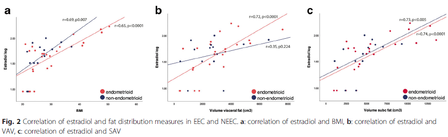

# LP02 - Corelația liniară & Regresia liniară simplă

---

# Tema 1 - Interpretarea corelației și regresiei din articol

**Articol:** van Weelden WJ et al. Impact of body mass index and fat distribution on sex steroid levels in endometrial carcinoma: a retrospective study. BMC Cancer. 2019;19(1):547.

**Eșantion:** n = 39 femei postmenopauză cu cancer endometrial
**Grupuri:** EEC (cancer endometrial de tip endometrioid) și NEEC (non-endometrioid)
**Variabile:** IMC, Volum grăsime viscerală (VAV), Volum grăsime subcutanată (SAV), Estradiol seric (log)

### Figura 2 din articol:

**Panel a:** Estradiol log vs IMC
- Endometrioid (roșu): r = 0.65, p < 0.0001
- Non-endometrioid (albastru): r = 0.69, p = 0.007

**Panel b:** Estradiol log vs Volum grăsime viscerală (VAV)
- Non-endometrioid: r = 0.72, p < 0.0001
- Endometrioid: r = 0.35, p = 0.224 (nesemnificativ)

**Panel c:** Estradiol log vs Volum grăsime subcutanată (SAV)
- Endometrioid: r = 0.74, p < 0.0001
- Non-endometrioid: r = 0.73, p < 0.005

---

## Cerința 1: Există o corelație liniară între IMC și nivelul seric de estradiol în eșantionul pacientelor cu cancer endometrial de tip endometrioid?

**Valoarea coeficientului de corelație:** r = 0.65

**Interpretare:** Există o corelație **pozitivă moderată** între IMC și nivelul seric de estradiol (log) la pacientele cu cancer endometrial de tip endometrioid. Pe măsură ce IMC-ul crește, nivelul seric de estradiol tinde să crească.

---

## Cerința 2: Există o corelație liniară semnificativă între IMC și nivelul seric de estradiol la pacientele cu cancer endometrial de tip endometrioid?

**Ipoteze:**
- **H0:** Nu există o corelație liniară semnificativă între IMC și estradiol în populația cu cancer endometrial de tip endometrioid (ρ = 0).
- **H1:** Există o corelație liniară semnificativă între IMC și estradiol în populația cu cancer endometrial de tip endometrioid (ρ ≠ 0).

**Rezultat:** p < 0.0001

**Decizie:** p < 0.05 → se respinge H0 → suntem în favoarea H1.

**Interpretare:** Există o corelație liniară semnificativă statistic între IMC și nivelul seric de estradiol la pacientele cu cancer endometrial de tip endometrioid (r = 0.65, p < 0.0001).

---

## Cerința 3: Există o dependență liniară semnificativă între IMC și nivelul seric de estradiol la pacientele cu cancer endometrial de tip endometrioid? (Regresie)

**Variabile:**
- VD (axa Y): Estradiol seric (log) — variabila pe care o prezicem
- VI (axa X): IMC — variabila predictoare

**Modelul:** Estradiol_log = B0 + B1 × IMC + ε

**Ipoteze:**
- **H0:** B1 = 0 (nu există o dependență liniară semnificativă între IMC și estradiol). Modelul: Y = B0 + ε
- **H1:** B1 ≠ 0 (există o dependență liniară semnificativă între IMC și estradiol). Modelul: Y = B0 + B1×X + ε

**Rezultat:** p < 0.0001

**Notă importantă:** În regresia liniară simplă, p-value-ul testului t pentru B1 este identic cu p-value-ul testului de corelație Pearson. Deci p(regresie simplă) = p(corelație).

**Decizie:** p < 0.05 → se respinge H0. Există o dependență liniară semnificativă între IMC și nivelul seric de estradiol la pacientele cu cancer endometrial de tip endometrioid.

**R²** = r² = 0.65² = **0.4225** → IMC-ul explică aproximativ 42.25% din variabilitatea nivelului seric de estradiol.

---

## Cerința 4: Dependența liniară dintre IMC și estradiol este aceeași la EEC și NEEC?

**Dreptele de regresie sunt paralele?** Nu.

Din graficul (a) se observă că cele 2 drepte de regresie au **pante diferite**, deci intensitatea relației nu este aceeași în cele două grupuri.

| Grup | r | p-value | Panta (vizual) |
|---|---|---|---|
| Endometrioid (EEC) | 0.65 | < 0.0001 | Mai mică |
| Non-endometrioid (NEEC) | 0.69 | 0.007 | Mai mare |

**În care grup depinde mai mult estradiolul de IMC?** În grupul **non-endometrioid (NEEC)**, deoarece:
- Coeficientul de corelație este mai mare (r = 0.69 vs r = 0.65)
- Panta dreptei de regresie este mai abruptă (vizibil din grafic)
- Aceasta înseamnă că la pacientele NEEC, creșterea IMC-ului se asociază cu o creștere mai pronunțată a estradiolului

---

## Observații suplimentare din Figura 2:

### Panel b (Estradiol vs Volum grăsime viscerală):
- La NEEC: r = 0.72, p < 0.0001 → corelație puternică, semnificativă
- La EEC: r = 0.35, p = 0.224 → corelație slabă, **nesemnificativă**
- **Concluzie:** Grăsimea viscerală se asociază semnificativ cu estradiolul doar la pacientele NEEC, nu și la EEC.

### Panel c (Estradiol vs Volum grăsime subcutanată):
- La EEC: r = 0.74, p < 0.0001 → corelație puternică, semnificativă
- La NEEC: r = 0.73, p < 0.005 → corelație puternică, semnificativă
- **Concluzie:** Grăsimea subcutanată se asociază puternic cu estradiolul în **ambele** grupuri, cu corelații aproape identice.

---

# Tema 2 - Discuție studiu: Seleniu, Zinc și severitatea COVID-19

**Articol:** Razeghi Jahromi S et al. The correlation between serum selenium, zinc, and COVID-19 severity: an observational study. BMC Infect Dis. 2021;21(1):899.

**Eșantion:** n = 84 pacienți cu COVID-19 (Iran)
**Grupuri de severitate:** ușoară (mild), moderată, severă
**Variabile:** Seleniu seric (Se), Zinc seric (Zn), CRP (proteina C reactivă), severitatea COVID-19

## Rezultate principale:

### Corelații cu CRP (Spearman):

| Variabilă | r | p-value | Interpretare |
|---|---|---|---|
| Seleniu vs CRP | -0.35 | 0.001 | Corelație negativă moderată, semnificativă |
| Zinc vs CRP | -0.41 | < 0.001 | Corelație negativă moderată, semnificativă |

**Interpretare:** Niveluri mai ridicate de seleniu și zinc se asociază cu niveluri mai scăzute de CRP (marker inflamator), sugerând un efect protector/antiinflamator.

### Regresie liniară (Se, Zn → severitate):

| Predictor | β | p-value |
|---|---|---|
| Seleniu | -0.28 | 0.01 |
| Zinc | -0.26 | 0.02 |

**Interpretare:** Niveluri mai ridicate de Se și Zn se asociază cu severitate mai scăzută a COVID-19.

### Analiza ajustată:
După ajustarea pentru factori de confundare, **asocierea semnificativă dintre Se, Zn și severitatea bolii se pierde**. Aceasta sugerează că relația observată poate fi mediată de alți factori (vârstă, comorbidități, status nutrițional general).

## Discuție privind condițiile de aplicabilitate ale regresiei liniare simple:

### Condiții verificate:

| Condiție | Prezentă în studiu? | Observații |
|---|---|---|
| **VD cantitativă continuă** | Parțial | Severitatea COVID-19 este o variabilă ordinală (ușoară/moderată/severă), nu cantitativă continuă. Utilizarea regresiei liniare pe o VD ordinală este discutabilă. |
| **VI cantitativă continuă** | Da | Se și Zn sunt măsurate ca concentrații serice (continuă). |
| **Relație liniară** | De verificat | Autorii ar trebui să prezinte scatter plots pentru a confirma liniaritatea. |
| **Normalitatea reziduurilor** | De verificat | Nu e clar dacă autorii au verificat acest lucru. Au folosit log-transformare pentru Se. |
| **Homoscedasticitate** | De verificat | Nu e menționat explicit. |
| **Independența observațiilor** | Da | Fiecare pacient este o observație independentă. |
| **Eșantion suficient** | Limitat | n = 84 este un eșantion relativ mic, mai ales când se împarte pe 3 grupuri de severitate. |

### Puncte critice de discuție:

1. **VD ordinală:** Severitatea COVID-19 (ușoară/moderată/severă) este o variabilă ordinală, nu continuă. Regresia liniară presupune o VD cantitativă continuă. O alternativă mai potrivită ar fi regresia logistică ordinală.

2. **Corelație Spearman vs Pearson:** Autorii au folosit corelația Spearman (non-parametrică), ceea ce este adecvat pentru variabile ordinale și distribuții non-normale. Pearson ar necesita normalitate bivariată.

3. **Confundare:** Asocierea semnificativă dispare după ajustare → rezultatul univariat era confundat. Acest lucru subliniază importanța regresiei multiple (ajustare pentru confunderi) față de regresia simplă.

4. **Cauzalitate:** Studiul este observațional, deci nu se poate stabili cauzalitate. Niveluri scăzute de Se/Zn pot fi cauza sau consecința severității bolii (cauzalitate inversă — boala severă consumă micronutrienții).

5. **Eșantion mic:** n = 84 limitează puterea statistică și generalizabilitatea rezultatelor. Cu eșantioane mici, estimările coeficienților sunt instabile.
