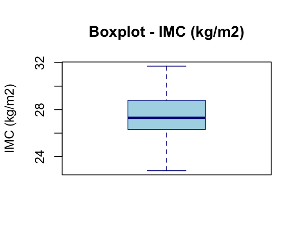
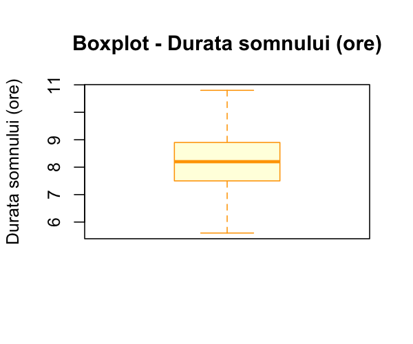
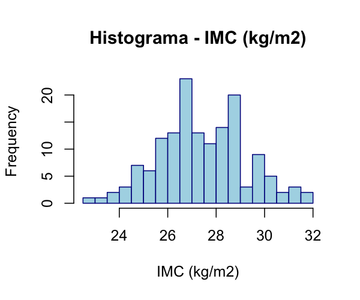
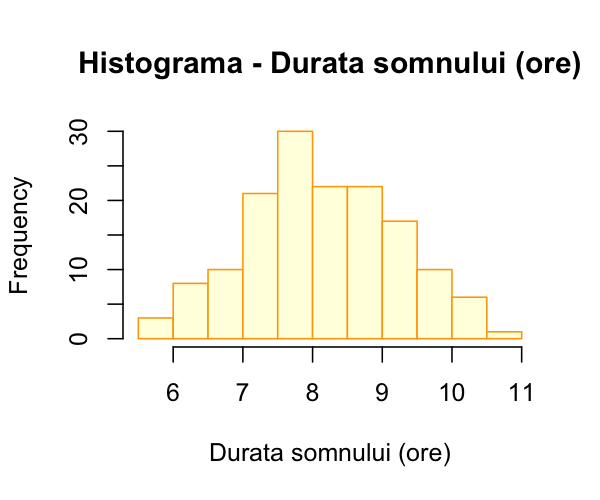
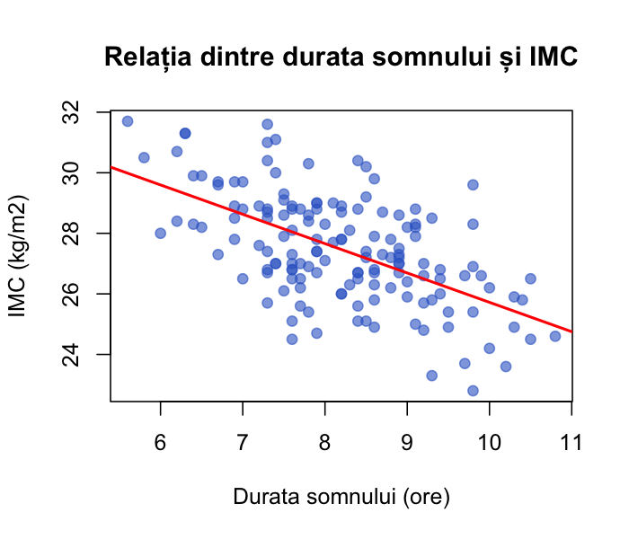
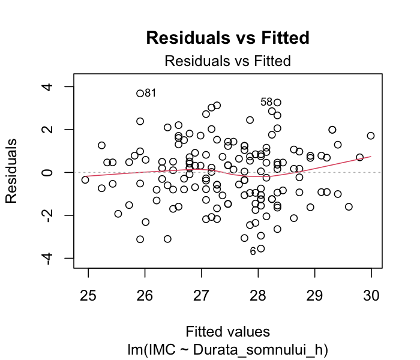
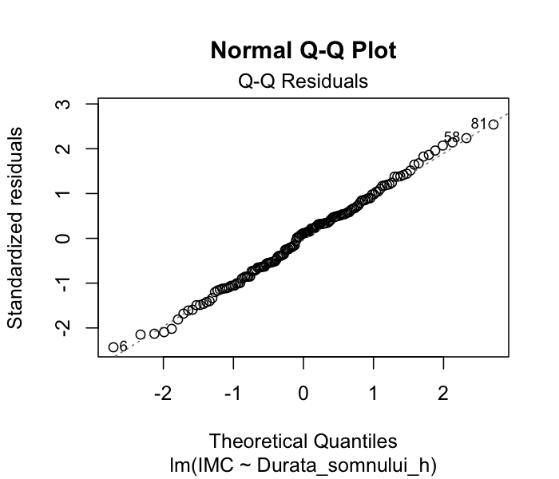
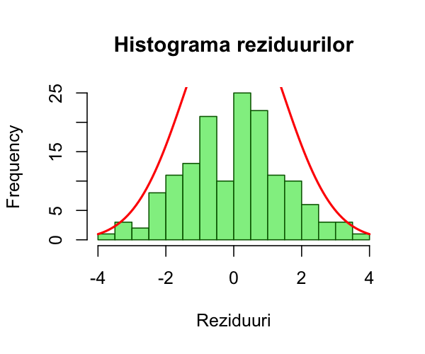
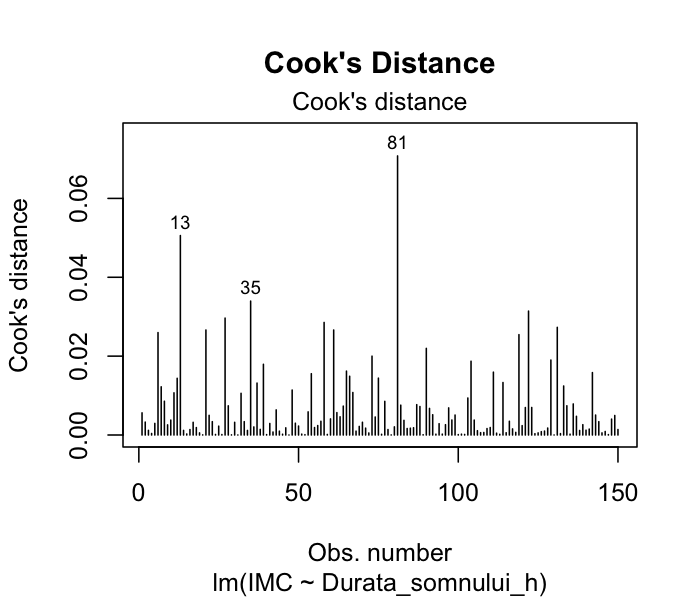
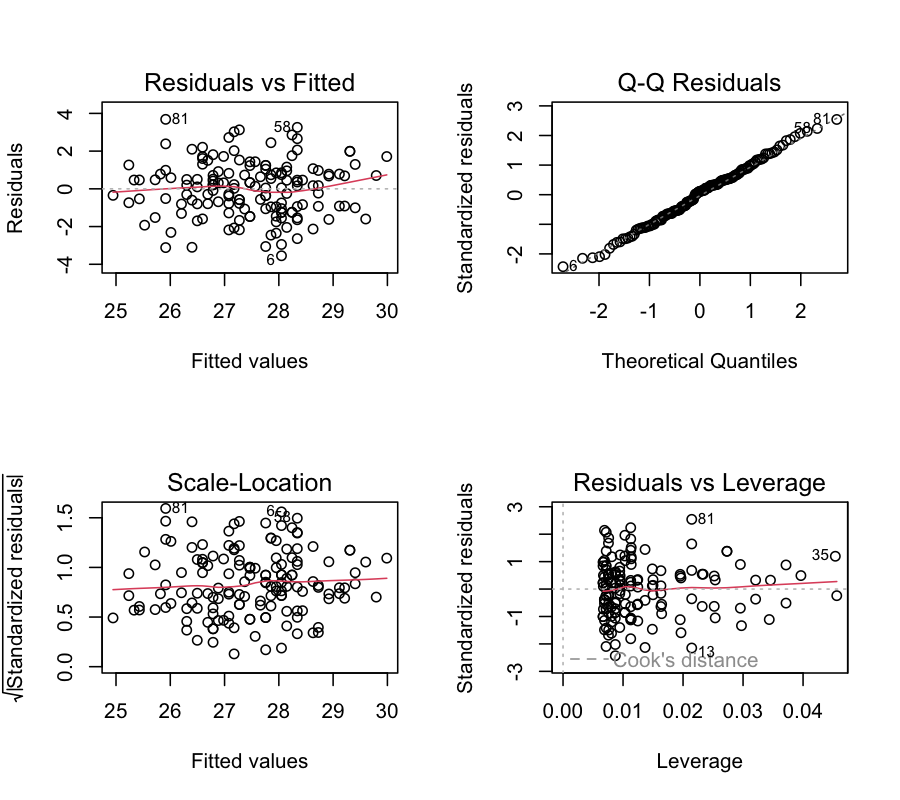

# LP03 - Modelul unifactorial de regresie liniară simplă

**Obiectiv:** Evaluarea dependenței liniare dintre durata somnului (ore) și indicele de masă corporală (IMC, kg/m2) la adulții tineri.
**Eșantion:** n = 150 subiecți adulți.

---

## 1. Specificarea variabilelor

| Nume Variabilă | Tipul variabilelor în funcție de scala de măsurare | Tipul variabilelor în funcție de relația dintre ele |
|---|---|---|
| IMC (kg/m2) | cantitativă continuă | variabilă dependentă |
| Durata_somnului_h (ore) | cantitativă continuă | variabilă independentă |

---

## 2. Analiza descriptivă

### Rezultate statistici descriptive:

| Statistică | IMC (kg/m2) | Durata somnului (ore) |
|---|---|---|
| N | 150 | 150 |
| Valori lipsă | 0 | 0 |
| Media | 27.47 | 8.20 |
| Mediana | 27.30 | 8.20 |
| Deviația standard | 1.80 | 1.08 |
| Minim | 22.80 | 5.60 |
| Maxim | 31.70 | 10.80 |
| Q1 | 26.33 | 7.50 |
| Q3 | 28.78 | 8.90 |
| IQR | 2.45 | 1.40 |
| Outliers | 0 | 0 |

### Grafice distribuții (Box-plot):







### Concluzia analizei descriptive:

Observând rezultatele analizei descriptive se constată că ambele variabile prezintă distribuții aproximativ simetrice (media ≈ mediana), fără valori lipsă și fără valori aberante (outliers) conform criteriului Q1-1.5×IQR / Q3+1.5×IQR. IMC-ul mediu al eșantionului este de 27.47 kg/m2 (SD = 1.80), ceea ce corespunde categoriei de supraponderalitate. Durata medie a somnului este de 8.20 ore (SD = 1.08), cu valori cuprinse între 5.60 și 10.80 ore.

---

## 3. Vizualizarea grafică a relației liniare (Scatter plot)



Graficul de tip nor de puncte sugerează o relație liniară negativă între durata somnului și IMC: pe măsură ce durata somnului crește, IMC-ul tinde să scadă.

---

## 4. Estimarea punctuală a parametrilor modelului de regresie liniară simplă

**IMC = 35.4190 + (-0.9698) × Durata_somnului_h**

- β0 (intercept) = 35.4190
- β1 (coeficient de regresie) = -0.9698

---

## 5. Testarea semnificației coeficientului de regresie β1

**Formularea ipotezelor:**
- H0: β1 = 0 (nu există relație liniară între durata somnului și IMC)
- H1: β1 ≠ 0 (există relație liniară între durata somnului și IMC)

**Statistica test:** t = -8.7301

**df** = n - k - 1 = 150 - 1 - 1 = 148

**p-value** = 4.955e-15

**Decizia testului:** p-value < 0.05, se respinge H0. Există o relație liniară semnificativă statistic între durata somnului și IMC (p < 0.001).

---

## 6. Estimarea parametrilor prin interval de încredere

- 95% IC pentru β0 (intercept): (33.6044, 37.2337)
- 95% IC pentru β1 (Durata_somnului_h): **(-1.1893, -0.7503)**

Intervalul de încredere pentru β1 nu conține valoarea 0, confirmând semnificația statistică a relației.

---

## 7. Evaluarea globală a modelului de regresie

**R² = 0.3399**

Coeficientul de corelație Pearson: r = -0.5830
r² = 0.3399 (coincide cu R² din model, conform proprietății regresiei liniare simple)

### Testul F al lui Fisher

**F(1, 148) = 76.2153**
- df1 = k = 1
- df2 = n - k - 1 = 148
- **p-value = 4.955e-15**

Modelul de regresie este semnificativ statistic (p < 0.001).

---

## 8. Diagnosticul modelului de regresie

### a) Liniaritatea modelului

Graficul scatter plot (secțiunea 3) și graficul Residuals vs Fitted arată o distribuție aleatorie a reziduurilor în jurul liniei de zero, fără un pattern sistematic, confirmând liniaritatea relației.



### b) Normalitatea erorilor

#### b1. Diagrama reziduurilor (Residuals vs Fitted)

Reziduurile sunt distribuite aleatoriu în jurul valorii 0, fără pattern evident.

#### b2. Grafic de cuantile (Q-Q plot)



Punctele urmăresc îndeaproape linia diagonală, indicând normalitate.

#### b3. Histograma reziduurilor



Distribuția reziduurilor are o formă aproximativ normală (în formă de clopot).

#### b4. Test de normalitate

**Shapiro-Wilk test:**
- W = 0.9945
- p-value = 0.8415

**Concluzie:** Reziduurile sunt normal distribuite (p = 0.84 > 0.05). Asumpția de normalitate este respectată.

### c) Homoscedasticitatea erorilor

#### c1. Graficele Residuals vs Fitted și Scale-Location


Graficul Scale-Location arată o linie roșie aproximativ orizontală, iar punctele sunt distribuite relativ uniform, sugerând homoscedasticitate.

#### c2. Test Breusch-Pagan

- BP = 0.0000016
- df = 1
- **p-value = 0.999**

**Concluzie:** Homoscedasticitatea este respectată (p = 0.999 > 0.05). Variabilitatea erorilor este constantă.

### d) Independența erorilor (testul Durbin-Watson)

- Statistica D-W = 2.0695
- Autocorrelation = -0.0385
- **p-value = 0.652**

**Concluzie:** Erorile sunt independente (p = 0.652 > 0.05). Valoarea D-W este aproape de 2, indicând absența autocorelației.

### e) Identificarea outlier-ilor și a punctelor influente




- Nr. observații cu Cook's D > 4/n: 7 (indici: 13, 27, 35, 58, 81, 122, 131)
- Nr. observații cu reziduuri standardizate |> 2|: 9

Niciuna dintre observațiile influente nu depășește pragul Cook's D = 0.5 (sau 1), deci nu există puncte cu influență majoră care ar necesita eliminare.

### Grafic diagnostic complet (4 panouri)



---

## 9. Interpretare finală

**Presupunând că modelul de regresie testat este valid:**

**Coeficientul de regresie estimat β1 = -0.9698:**
La fiecare oră în plus de somn, indicele de masă corporală scade în medie cu 0.97 kg/m2 (95% IC: -1.19 până la -0.75). Relația este semnificativă statistic (t = -8.73, p < 0.001).

**Coeficientul de determinare R² = 0.3399:**
33.99% din variabilitatea indicelui de masă corporală este explicată de durata somnului. Restul de 66.01% din variabilitate este datorat altor factori neincluși în model.

**Concluzie generală:**
Există o relație liniară negativă semnificativă statistic între durata somnului și indicele de masă corporală la adulții tineri (r = -0.583, p < 0.001). Modelul de regresie liniară simplă IMC = 35.42 - 0.97 × Durata_somnului este valid, toate asumpțiile fiind respectate: liniaritate, normalitatea reziduurilor (Shapiro-Wilk p = 0.84), homoscedasticitate (Breusch-Pagan p = 0.999) și independența erorilor (Durbin-Watson p = 0.652).

---

## Cod R utilizat

```r
# =============================================================================
# LP03 - Modelul unifactorial de regresie liniara simpla
# Variabila dependenta: IMC (kg/m2)
# Variabila independenta: Durata_somnului_h (ore)
# =============================================================================

library(car)     # Durbin-Watson
library(lmtest)  # Breusch-Pagan

# Citire date
data <- read.csv("data.csv", stringsAsFactors = FALSE)

# Analiza descriptiva
summary(data$IMC)
summary(data$Durata_somnului_h)
sd(data$IMC)
sd(data$Durata_somnului_h)

# Boxplots
boxplot(data$IMC, main = "Boxplot - IMC (kg/m2)")
boxplot(data$Durata_somnului_h, main = "Boxplot - Durata somnului (ore)")

# Histograme
hist(data$IMC, main = "Histograma - IMC", breaks = 15)
hist(data$Durata_somnului_h, main = "Histograma - Durata somnului", breaks = 15)

# Scatter plot
plot(data$Durata_somnului_h, data$IMC,
     main = "Relatia dintre durata somnului si IMC",
     xlab = "Durata somnului (ore)", ylab = "IMC (kg/m2)",
     pch = 19, col = rgb(0.2, 0.4, 0.8, 0.6))
abline(lm(IMC ~ Durata_somnului_h, data = data), col = "red", lwd = 2)

# Modelul de regresie
model <- lm(IMC ~ Durata_somnului_h, data = data)
summary(model)

# Intervale de incredere
confint(model, level = 0.95)

# Corelatie Pearson
cor.test(data$Durata_somnului_h, data$IMC)

# Diagnostic
plot(model)  # 4-panel diagnostic

# Shapiro-Wilk
shapiro.test(residuals(model))

# Breusch-Pagan
bptest(model)

# Durbin-Watson
durbinWatsonTest(model)

# Cook's Distance
cooks.distance(model)
```

## Rezultate brute R (needitate)

```
Call:
lm(formula = IMC ~ Durata_somnului_h, data = data)

Residuals:
    Min      1Q  Median      3Q     Max
-3.5487 -0.9934  0.1649  0.8991  3.6849

Coefficients:
                  Estimate Std. Error t value Pr(>|t|)
(Intercept)        35.4190     0.9183   38.57  < 2e-16 ***
Durata_somnului_h  -0.9698     0.1111   -8.73 4.96e-15 ***

Residual standard error: 1.466 on 148 degrees of freedom
Multiple R-squared:  0.3399,  Adjusted R-squared:  0.3355
F-statistic: 76.22 on 1 and 148 DF,  p-value: 4.955e-15

95% CI for coefficients:
                       2.5 %     97.5 %
(Intercept)        33.604355 37.233716
Durata_somnului_h  -1.189332 -0.750334

Pearson correlation: r = -0.5830, p-value = 4.955e-15

Shapiro-Wilk: W = 0.9945, p-value = 0.8415
Breusch-Pagan: BP = 0.0000016, df = 1, p-value = 0.999
Durbin-Watson: DW = 2.0695, p-value = 0.652

Cook's D > 4/n: 7 observations (indices: 13, 27, 35, 58, 81, 122, 131)
Standardized residuals |> 2|: 9 observations
```
