# LP04 - Regresia liniară simplă cu variabilă explicativă de tip calitativ

**Eșantion:** n = 248 subiecți adulți
**VD:** IMC (kg/m2) - variabilă cantitativă continuă

---

# CAZUL II - Variabila independentă calitativă dihotomială

**Obiectiv:** Evaluarea asocierii dintre durata somnului (< 7 ore vs. ≥ 7 ore) și IMC la adulții tineri.

## 1. Specificarea variabilelor

| Nume Variabilă | Tip (scala de măsurare) | Tip (relația dintre ele) |
|---|---|---|
| IMC (kg/m2) | cantitativă continuă | variabilă dependentă |
| Durata_somunului_2cat | calitativă dihotomială (0 = ≥7h, 1 = <7h) | variabilă independentă |

## 2. Analiza descriptivă

### Rezultate statistici descriptive:

**IMC (kg/m2) - global:**

| Statistică | Valoare |
|---|---|
| N | 248 |
| Valori lipsă | 0 |
| Media | 24.89 |
| Mediana | 24.55 |
| SD | 3.65 |
| Min | 16.50 |
| Max | 36.80 |
| Q1 | 22.20 |
| Q3 | 26.63 |
| IQR | 4.43 |
| Outliers | 5 |

**IMC per grup:**

| Grup | n | Media | SD | Mediana |
|---|---|---|---|---|
| ≥ 7 ore (referință) | 183 | 23.33 | 2.36 | 23.40 |
| < 7 ore | 65 | 29.28 | 2.99 | 29.20 |

### Grafice distribuții (Box-plot):

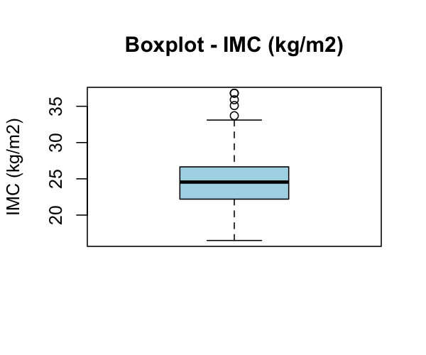

### Concluzia analizei descriptive:

Observând rezultatele analizei descriptive se constată că IMC-ul mediu global este de 24.89 kg/m2 (SD = 3.65), cu o distribuție relativ simetrică (media ≈ mediana). Nu există valori lipsă. Se observă 5 valori aberante. Există o diferență notabilă între cele două grupuri: cei cu somn scurt (< 7 ore) au un IMC mediu de 29.28 kg/m2 (supraponderali), comparativ cu 23.33 kg/m2 (normponderali) la cei cu somn ≥ 7 ore.

### Vizualizarea grafică a relației (Box-plot pe grupuri):

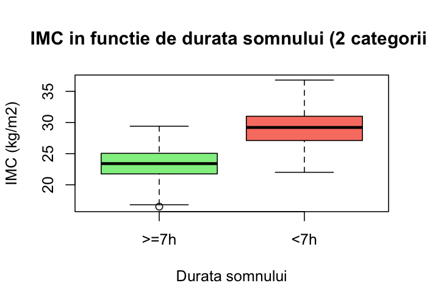

## 3. Estimarea punctuală a parametrilor modelului

**IMC = 23.3306 + 5.9448 × Durata_somn_<7h**

- β0 = 23.3306 (media IMC în grupul de referință ≥ 7 ore)
- β1 = 5.9448 (diferența de medie IMC între < 7h și ≥ 7h)

## 4. Testarea semnificației coeficientului de regresie β1

**Formularea ipotezelor:**
- H0: β1 = 0 (nu există diferență de IMC între cele 2 grupuri de durată a somnului)
- H1: β1 ≠ 0 (există diferență de IMC între cele 2 grupuri)

**Statistica test:** t = 16.1955

**df** = n - k - 1 = 248 - 1 - 1 = 246

**p-value** < 2.2e-16

**Decizia testului:** p-value < 0.05, se respinge H0. Există o diferență semnificativă statistic de IMC între cele două grupuri de durată a somnului.

## 5. Estimarea parametrilor prin interval de încredere

- 95% IC pentru β0: (22.9605, 23.7007)
- **95% IC pentru β1: (5.2218, 6.6678)**

Intervalul de încredere nu conține 0, confirmând semnificația statistică.

## 6. Evaluarea globală a modelului

**R² = 0.5160**

## 7. Testul F al lui Fisher

**F(1, 246) = 262.2958**
- df1 = k = 1
- df2 = n - k - 1 = 246
- **p-value < 2.2e-16**

## 8. Diagnosticul modelului

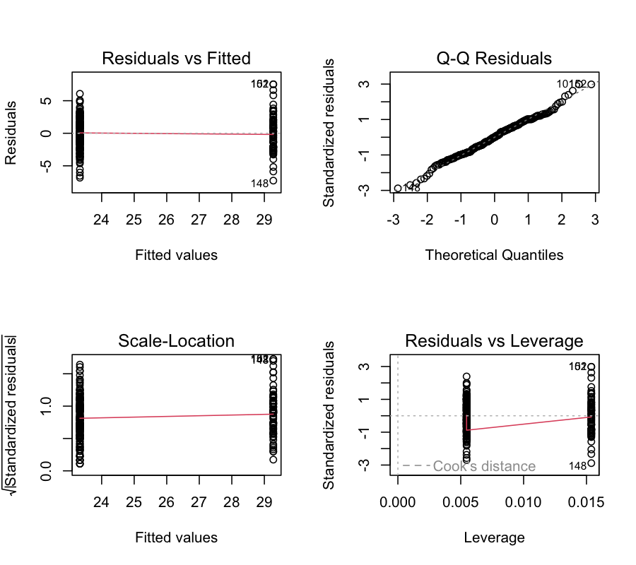

### a) Liniaritatea

În cazul regresiei cu variabilă dihotomială, liniaritatea este automat satisfăcută (doar 2 valori posibile pentru X).

### b) Normalitatea erorilor

#### b1. Diagrama reziduurilor (Residuals vs Fitted):
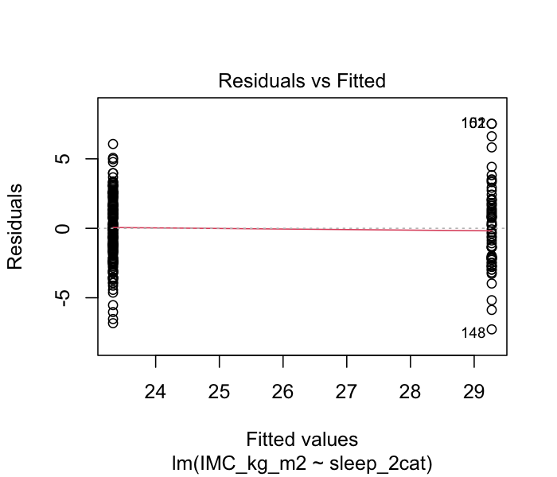

#### b2. Grafic de cuantile (Q-Q plot):
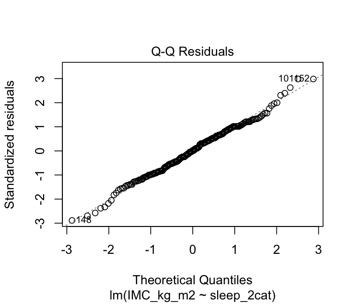

#### b3. Histograma reziduurilor:
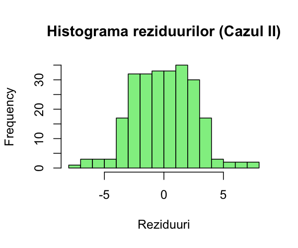

#### b4. Test de normalitate:
**Shapiro-Wilk:** W = 0.9933, p = 0.3345
Concluzie: Reziduurile sunt normal distribuite (p > 0.05).

### c) Homoscedasticitatea erorilor

#### c1. Grafice Scale-Location:
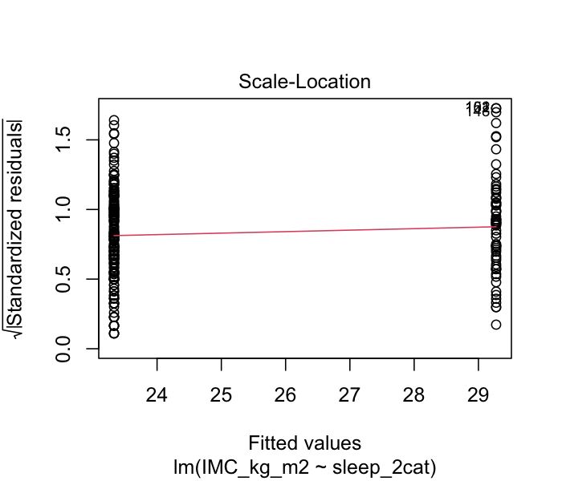

#### c2. Test Breusch-Pagan:
BP = 5.5589, df = 1, **p-value = 0.018**
Concluzie: Se detectează heteroscedasticitate (p < 0.05). Variabilitatea reziduurilor diferă între cele două grupuri. Aceasta este o limitare a modelului, dar rezultatele rămân informative datorită dimensiunii eșantionului.

### d) Independența erorilor (Durbin-Watson):
DW = 1.7919, p = 0.130
Concluzie: Erorile sunt independente (p > 0.05).

### e) Identificarea outlier-ilor și a punctelor influente:
- Cook's D > 4/n: 12 observații
- Reziduuri standardizate |> 2|: 12 observații
- Niciuna nu depășește pragul Cook's D = 0.5.

## 9. Interpretare

**Coeficientul de regresie estimat β1 = 5.9448:**
Persoanele cu durata somnului < 7 ore au un IMC mediu cu 5.94 kg/m2 mai mare decât persoanele cu durata somnului ≥ 7 ore (95% IC: 5.22 - 6.67, p < 0.001). Media IMC este de 23.33 kg/m2 la cei cu somn ≥ 7h și 29.28 kg/m2 la cei cu somn < 7h.

**Coeficientul de determinare R² = 0.5160:**
51.60% din variabilitatea IMC este explicată de durata somnului (dichotomizată). Restul de 48.40% este datorat altor factori.

## 10. Comparație cu testul t independent

| Metodă | t | p-value |
|---|---|---|
| Regresie liniară | 16.1955 | < 2.2e-16 |
| Test t independent | -16.1955 | < 2.2e-16 |

Valorile statisticii t sunt identice (cu semn opus datorită ordinii grupurilor). **Regresia liniară simplă cu o variabilă independentă dihotomială este echivalentă matematic cu testul t pentru eșantioane independente** (cu varianțe egale). Ambele metode testează aceeași ipoteză: existența unei diferențe semnificative de medie IMC între cele două grupuri.

---

# CAZUL III - Variabila independentă calitativă nominală/ordinală

**Obiectiv:** Evaluarea asocierii dintre durata somnului (scurtă, optimă, lungă) și IMC la adulții tineri.

## 1. Specificarea variabilelor

| Nume Variabilă | Tip (scala de măsurare) | Tip (relația dintre ele) |
|---|---|---|
| IMC (kg/m2) | cantitativă continuă | variabilă dependentă |
| Durata_somunului_3cat | calitativă nominală (3 categorii) | variabilă independentă |

Categorii: 0 = Optim (7-9h) [referință], 1 = Scurt (<7h), 2 = Lung (>9h)

## 2. Analiza descriptivă

### Rezultate statistici descriptive:

| Grup | n | Media | SD | Mediana | Q1 | Q3 | Outliers |
|---|---|---|---|---|---|---|---|
| Optim (7-9h) | 105 | 24.16 | 1.87 | 24.30 | 22.80 | 25.70 | 0 |
| Scurt (<7h) | 65 | 29.28 | 2.99 | 29.20 | 27.10 | 31.00 | 0 |
| Lung (>9h) | 78 | 22.21 | 2.51 | 22.20 | 20.55 | 23.70 | 0 |

### Grafice distribuții (Box-plot):

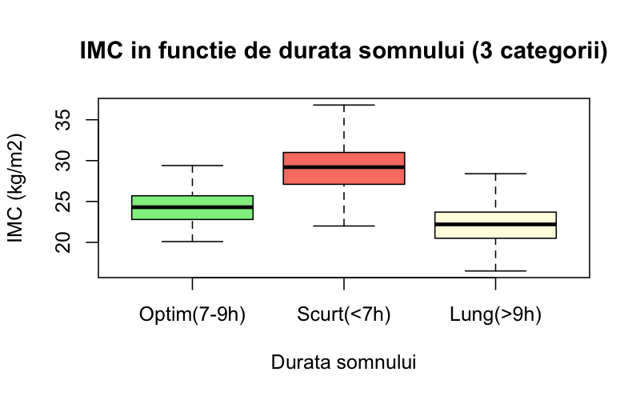

### Concluzia analizei descriptive:

Observând rezultatele analizei descriptive se constată diferențe importante de IMC între cele trei grupuri. Grupul cu somn scurt (< 7 ore) prezintă cel mai ridicat IMC mediu (29.28 kg/m2), urmat de grupul cu somn optim (24.16 kg/m2) și cel cu somn lung (22.21 kg/m2). Nu există valori aberante în niciunul dintre cele trei grupuri. Distribuțiile sunt aproximativ simetrice în fiecare grup.

### Vizualizarea grafică:

Boxplot-ul de mai sus arată clar separarea celor trei grupuri, cu IMC cel mai ridicat la cei cu somn scurt.

## 3. Estimarea punctuală a parametrilor modelului

**IMC = 24.1638 + 5.1116 × Scurt(<7h) + (-1.9548) × Lung(>9h)**

- β0 = 24.1638 (media IMC în grupul de referință - Optim 7-9h)
- β1 = 5.1116 (diferența medie IMC: Scurt vs Optim)
- β2 = -1.9548 (diferența medie IMC: Lung vs Optim)

## 4. Testarea semnificației coeficienților

### β1 (Scurt vs Optim):
- H0: β1 = 0 (nu există diferență IMC între somn scurt și optim)
- H1: β1 ≠ 0
- **t = 13.4591**, df = 245, **p < 2.2e-16**
- Decizia: Diferență semnificativă statistic.

### β2 (Lung vs Optim):
- H0: β2 = 0 (nu există diferență IMC între somn lung și optim)
- H1: β2 ≠ 0
- **t = -5.4345**, df = 245, **p = 1.33e-07**
- Decizia: Diferență semnificativă statistic.

## 5. Estimarea parametrilor prin interval de încredere

| Parametru | 95% IC |
|---|---|
| β0 (Intercept) | (23.7012, 24.6264) |
| β1 (Scurt vs Optim) | (4.3635, 5.8596) |
| β2 (Lung vs Optim) | (-2.6634, -1.2463) |

Ambele intervale nu conțin 0, confirmând semnificația.

## 6. Evaluarea globală a modelului

**R² = 0.5681**
**R² ajustat = 0.5646**

## 7. Testul F al lui Fisher

**F(2, 245) = 161.1269**
- df1 = k = 2
- df2 = n - k - 1 = 245
- **p-value < 2.2e-16**

## 8. Diagnosticul modelului

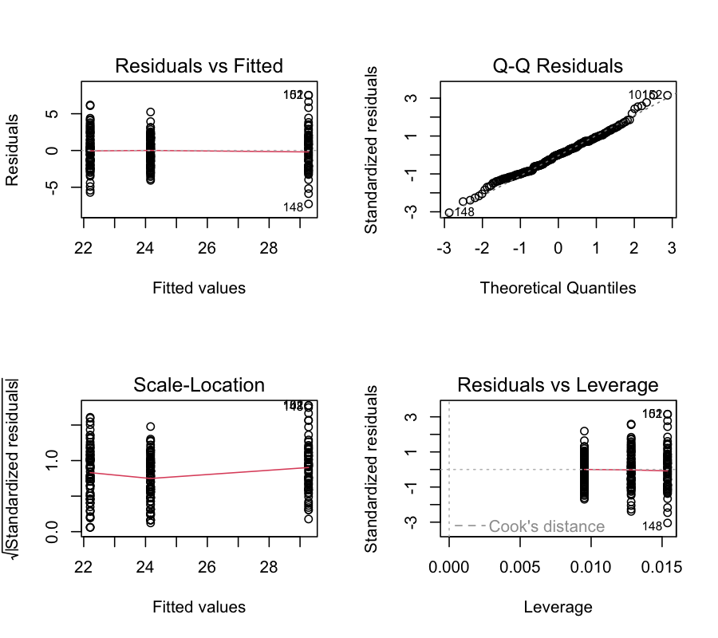

### a) Liniaritatea:
Cu variabilă categorială, liniaritatea se verifică prin relația dintre grupuri.

### b) Normalitatea erorilor:

#### b1-b3. Grafice:
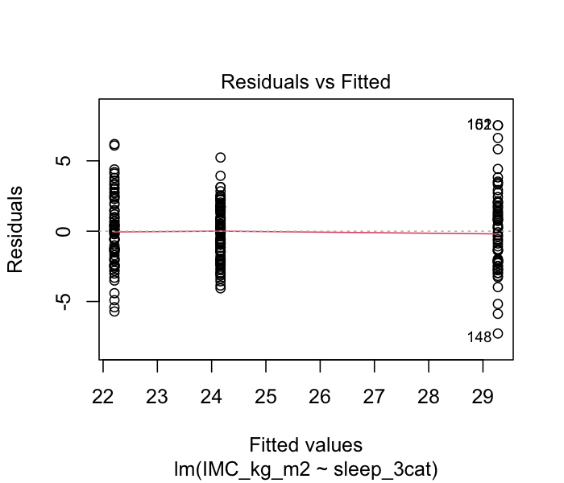
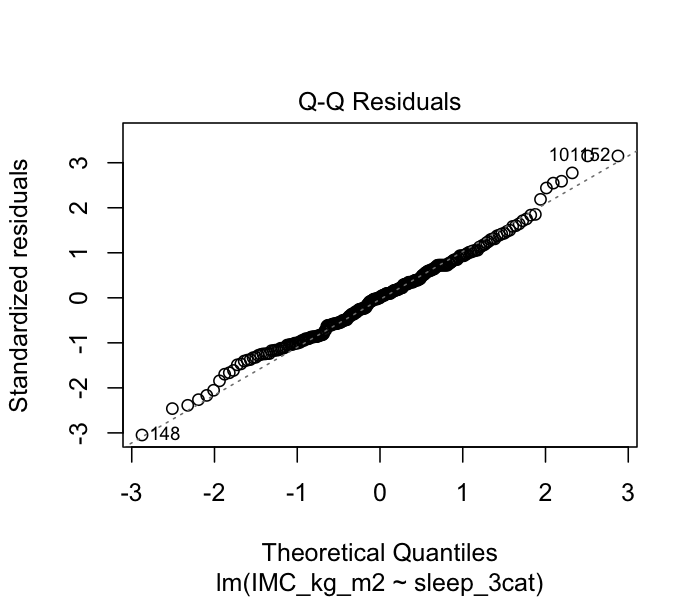
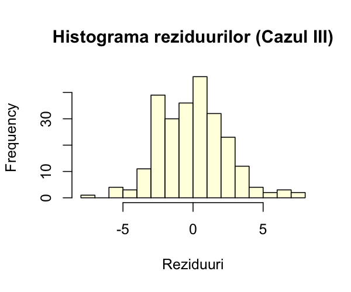

#### b4. Test de normalitate:
**Shapiro-Wilk:** W = 0.9905, p = 0.106
Concluzie: Reziduurile sunt normal distribuite (p > 0.05).

### c) Homoscedasticitatea erorilor:

#### c1. Grafic Scale-Location:
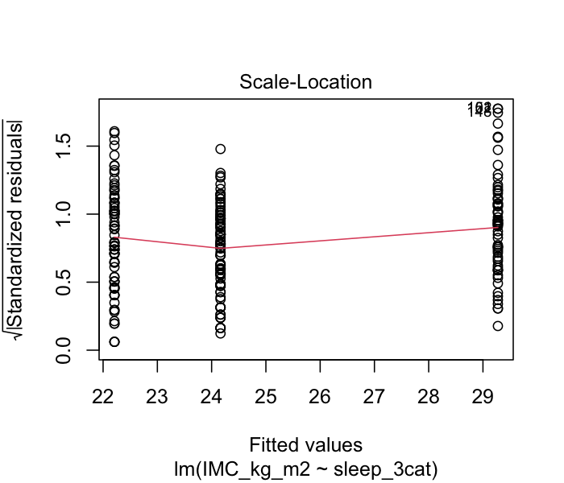

#### c2. Test Breusch-Pagan:
BP = 14.4010, df = 1, **p-value = 0.0007**
Concluzie: Se detectează heteroscedasticitate (p < 0.05). Variabilitatea diferă între grupuri (SD: Optim=1.87, Scurt=2.99, Lung=2.51). Aceasta este o limitare a modelului.

### d) Independența erorilor (Durbin-Watson):
DW = 1.9431, p = 0.588
Concluzie: Erorile sunt independente (p > 0.05).

### e) Identificarea outlier-ilor și a punctelor influente:
- Cook's D > 4/n: 13 observații
- Reziduuri standardizate |> 2|: 13 observații
- Niciuna nu depășește pragul Cook's D = 0.5.

## 9. Interpretare

**Coeficientul de regresie β1 (Scurt vs Optim) = 5.1116:**
Persoanele cu durata somnului < 7 ore au un IMC mediu cu 5.11 kg/m2 mai mare decât persoanele cu somn optim (7-9 ore) (95% IC: 4.36 - 5.86, p < 0.001).

**Coeficientul de regresie β2 (Lung vs Optim) = -1.9548:**
Persoanele cu durata somnului > 9 ore au un IMC mediu cu 1.95 kg/m2 mai mic decât persoanele cu somn optim (95% IC: -2.66 - -1.25, p < 0.001).

**Media IMC per grup:** Optim = 24.16, Scurt = 29.28, Lung = 22.21 kg/m2.

**Coeficientul de determinare R² = 0.5681:**
56.81% din variabilitatea IMC este explicată de durata somnului (3 categorii).

## 10. Comparație cu ANOVA one-way

| Sursă | df | Sum Sq | Mean Sq | F | p |
|---|---|---|---|---|---|
| sleep_3cat | 2 | 1866 | 933.0 | 161.1 | < 2e-16 |
| Residuals | 245 | 1419 | 5.8 | | |

Testul F din regresie (F = 161.13, p < 2.2e-16) și cel din ANOVA one-way sunt identice. **Regresia liniară cu variabilă nominală cu k categorii (codificată prin k-1 variabile dummy) este echivalentă matematic cu ANOVA one-way.**

### Post-hoc Tukey HSD:

| Comparație | Diferență | 95% IC | p adjusted |
|---|---|---|---|
| Scurt - Optim | 5.11 | (4.22, 6.01) | < 0.001 |
| Lung - Optim | -1.95 | (-2.80, -1.11) | < 0.001 |
| Lung - Scurt | -7.07 | (-8.02, -6.11) | < 0.001 |

Toate comparațiile perechi sunt semnificative statistic (p < 0.001).

---

## Cod R utilizat

```r
library(car)
library(lmtest)

data <- read.csv("data.csv", stringsAsFactors = FALSE)

# CAZUL II - dihotomial
data$sleep_2cat <- factor(data$Durata_somunului_2cat, levels = c(0, 1),
                          labels = c(">=7h", "<7h"))
model2 <- lm(IMC_kg_m2 ~ sleep_2cat, data = data)
summary(model2)
confint(model2)

# Diagnostic
plot(model2)
shapiro.test(residuals(model2))
bptest(model2)
durbinWatsonTest(model2)

# Comparatie t-test
t.test(IMC_kg_m2 ~ sleep_2cat, data = data, var.equal = TRUE)

# CAZUL III - 3 categorii
data$sleep_3cat <- factor(data$Durata_somunului_3cat, levels = c(0, 1, 2),
                          labels = c("Optim(7-9h)", "Scurt(<7h)", "Lung(>9h)"))
model3 <- lm(IMC_kg_m2 ~ sleep_3cat, data = data)
summary(model3)
confint(model3)

# Diagnostic
plot(model3)
shapiro.test(residuals(model3))
bptest(model3)
durbinWatsonTest(model3)

# Comparatie ANOVA + Tukey
aov_model <- aov(IMC_kg_m2 ~ sleep_3cat, data = data)
summary(aov_model)
TukeyHSD(aov_model)
```

## Rezultate brute R

```
CAZUL II:
IMC per grup: >=7h (n=183): Media=23.33, SD=2.36 | <7h (n=65): Media=29.28, SD=2.99

lm(IMC_kg_m2 ~ sleep_2cat):
              Estimate Std.Error t value  Pr(>|t|)
(Intercept)    23.3306   0.1879   124.2   <2e-16 ***
sleep_2cat<7h   5.9448   0.3671    16.2   <2e-16 ***

R² = 0.5160, F(1,246) = 262.30, p < 2.2e-16
95% CI β1: (5.2218, 6.6678)
Shapiro-Wilk: W=0.9933, p=0.3345 (normal)
Breusch-Pagan: BP=5.56, p=0.018 (heteroscedasticitate)
Durbin-Watson: DW=1.79, p=0.130 (independent)
t-test: t=-16.20, p<2.2e-16 (identic cu regresia)

CAZUL III:
IMC per grup: Optim(n=105)=24.16 | Scurt(n=65)=29.28 | Lung(n=78)=22.21

lm(IMC_kg_m2 ~ sleep_3cat):
                      Estimate Std.Error t value  Pr(>|t|)
(Intercept)            24.1638   0.2348  102.895  <2e-16 ***
sleep_3catScurt(<7h)    5.1116   0.3798   13.459  <2e-16 ***
sleep_3catLung(>9h)    -1.9548   0.3597   -5.435  1.33e-07 ***

R² = 0.5681, F(2,245) = 161.13, p < 2.2e-16
95% CI β1: (4.3635, 5.8596), β2: (-2.6634, -1.2463)
Shapiro-Wilk: W=0.9905, p=0.106 (normal)
Breusch-Pagan: BP=14.40, p=0.0007 (heteroscedasticitate)
Durbin-Watson: DW=1.94, p=0.588 (independent)
ANOVA: F(2,245)=161.1, p<2e-16 (identic cu regresia)
Tukey: toate comparațiile p<0.001
```
