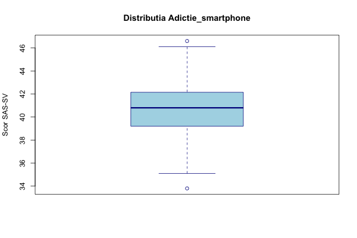
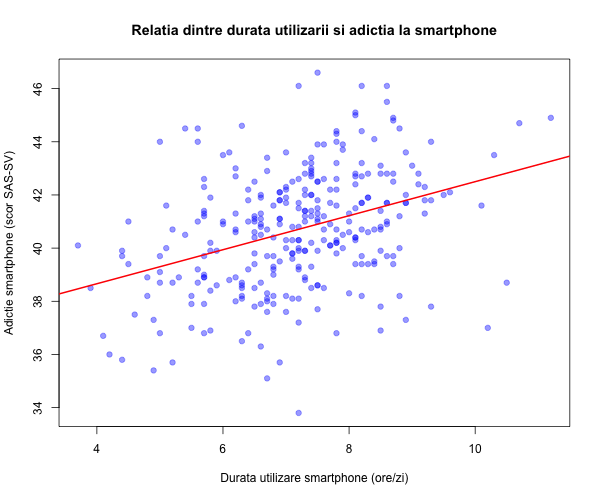
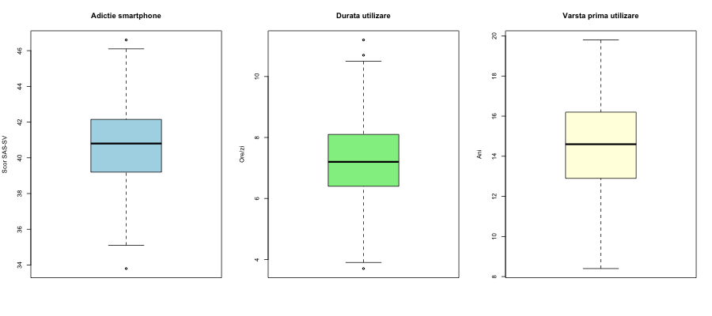
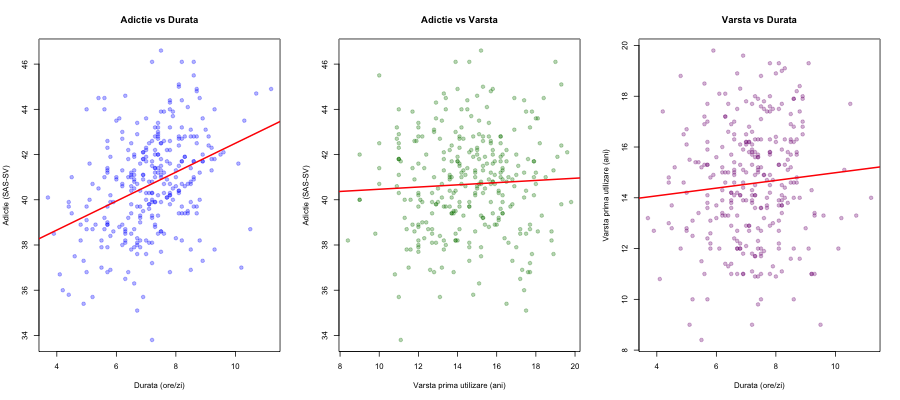
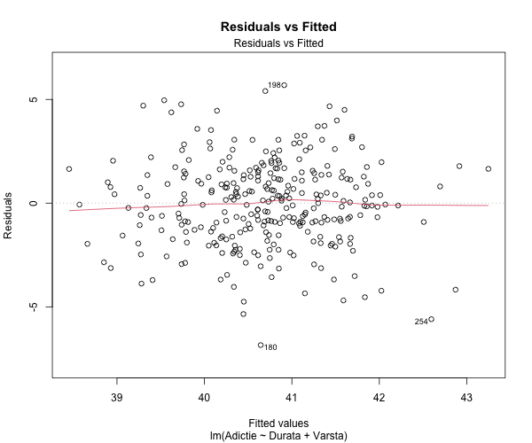
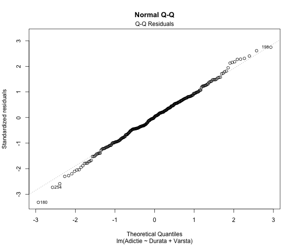
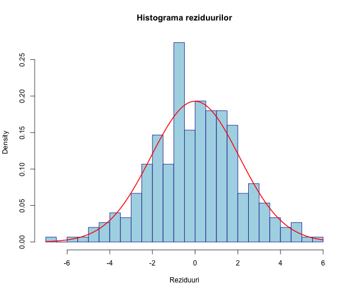
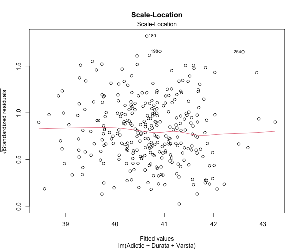
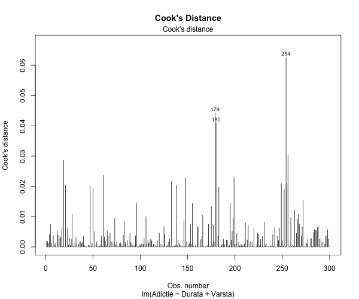

# LP05 - Regresia liniară multiplă cu 2 variabile independente cantitative

**Eșantion:** n = 300 studenți anul I UMF (2018-2019)
**VD:** Adictie_smartphone (scor SAS-SV, 10-60)
**VI1:** Durata_utilizare_smartphone (ore/zi)
**VI2:** Varsta_utilizare_smartphone (vârsta la prima utilizare, ani)

---

# CAZUL I - Regresie liniară simplă

**Obiectiv:** Evaluarea relației liniare semnificative dintre durata de utilizare a smartphone-ului și adictia la smartphone.

## 1. Specificarea variabilelor

| Nume Variabilă | Tip (scala de măsurare) | Tip (relația dintre ele) |
|---|---|---|
| Adictie_smartphone (scor SAS-SV) | cantitativă continuă | variabilă dependentă |
| Durata_utilizare_smartphone (ore/zi) | cantitativă continuă | variabilă independentă |

## 2. Analiza descriptivă

**Adictie_smartphone (scor SAS-SV):**

| Statistică | Valoare |
|---|---|
| N | 300 |
| Valori lipsă | 0 |
| Media | 40.69 |
| Mediana | 40.80 |
| SD | 2.22 |
| Min | 33.80 |
| Max | 46.60 |
| Q1 | 39.20 |
| Q3 | 42.12 |
| IQR | 2.92 |
| Outliers | 2 |

**Durata_utilizare_smartphone (ore/zi):**

| Statistică | Valoare |
|---|---|
| N | 300 |
| Valori lipsă | 0 |
| Media | 7.17 |
| Mediana | 7.20 |
| SD | 1.27 |
| Min | 3.70 |
| Max | 11.20 |
| Q1 | 6.40 |
| Q3 | 8.10 |
| IQR | 1.70 |
| Outliers | 3 |

### Concluzia analizei descriptive:

Scorul mediu de adictie la smartphone este de 40.69 (SD = 2.22), cu o distribuție relativ simetrică (media ≈ mediana). Durata medie de utilizare a smartphone-ului este de 7.17 ore/zi (SD = 1.27). Se observă 2 outlieri pentru adictie și 3 pentru durată. Nu există valori lipsă.

### Grafice distribuții (Box-plot):




### Vizualizarea grafică a relației (Scatter plot):



## 3. Corelația

| Statistică | Valoare |
|---|---|
| Pearson r | 0.3658 |
| t | 6.7854 |
| df | 298 |
| p-value | 6.244e-11 |
| 95% CI | [0.2635, 0.4600] |

**Interpretare:** Există o corelație pozitivă semnificativă statistic de intensitate moderată (r = 0.366, p < 0.001) între durata de utilizare a smartphone-ului și scorul de adictie.

## 4. Modelul de regresie liniară simplă

**Adictie = 36.1000 + 0.6401 × Durata**

### Tabelul 0 - Rezultate regresie liniară simplă

| Variabilă | Coeficient (B) | SE | IC 95% inferior | IC 95% superior | t(df) | p-value |
|---|---|---|---|---|---|---|
| (Intercept) | 36.1000 | 0.6866 | 34.7488 | 37.4512 | 52.5776(298) | < 2.2e-16 |
| Durata | 0.6401 | 0.0943 | 0.4545 | 0.8258 | 6.7854(298) | 6.244e-11 |

### Testarea semnificației coeficientului de regresie β1

- **H0:** β1 = 0 (nu există relație liniară semnificativă)
- **H1:** β1 ≠ 0 (există relație liniară semnificativă)
- **t** = 6.7854, **df** = 298, **p** = 6.244e-11
- **Decizie:** p < 0.05 → se respinge H0. Există o relație liniară semnificativă statistic între durata de utilizare a smartphone-ului și scorul de adictie.

### Coeficientul de determinare

- **R²** = 0.1338
- **R² ajustat** = 0.1309
- **F** = 46.04 pe 1 și 298 df, **p** = 6.244e-11

**Interpretare:** 13.4% din variabilitatea scorului de adictie la smartphone este explicată de durata zilnică de utilizare a smartphone-ului.

---

# CAZUL II - Regresie liniară multiplă cu 2 variabile independente cantitative

**Obiectiv:** Evaluarea relației liniare semnificative dintre durata de utilizare a smartphone-ului, vârsta la prima utilizare și adictia la smartphone.

## 1. Specificarea variabilelor

| Nume Variabilă | Tip (scala de măsurare) | Tip (relația dintre ele) |
|---|---|---|
| Adictie_smartphone (scor SAS-SV) | cantitativă continuă | variabilă dependentă |
| Durata_utilizare_smartphone (ore/zi) | cantitativă continuă | variabilă independentă |
| Varsta_utilizare_smartphone (ani) | cantitativă continuă | variabilă independentă |

## 2. Statistici descriptive

**Varsta_utilizare_smartphone (ani):**

| Statistică | Valoare |
|---|---|
| N | 300 |
| Valori lipsă | 0 |
| Media | 14.56 |
| Mediana | 14.60 |
| SD | 2.29 |
| Min | 8.40 |
| Max | 19.80 |
| Q1 | 12.90 |
| Q3 | 16.20 |
| IQR | 3.30 |
| Outliers | 0 |

(Statisticile descriptive pentru Adictie și Durata sunt identice cu cele din Cazul I.)

### Box-plots:



### Scatter plots:



## 3. Matricea de corelație

| | Adictie | Durata | Varsta |
|---|---|---|---|
| Adictie | 1.0000 | 0.3658 | 0.0502 |
| Durata | 0.3658 | 1.0000 | 0.0841 |
| Varsta | 0.0502 | 0.0841 | 1.0000 |

| Pereche | r | t | df | p-value |
|---|---|---|---|---|
| Adictie vs Durata | 0.3658 | 6.7854 | 298 | 6.244e-11 |
| Adictie vs Varsta | 0.0502 | 0.8681 | 298 | 0.386 |
| Durata vs Varsta | 0.0841 | 1.4570 | 298 | 0.1462 |

**Interpretare:** Doar corelația dintre durata de utilizare și adictie este semnificativă (r = 0.366, p < 0.001). Vârsta la prima utilizare nu corelează semnificativ nici cu adictia (r = 0.050, p = 0.386), nici cu durata (r = 0.084, p = 0.146). Nu există probleme de coliniaritate între variabilele independente.

## 4. Modelul de regresie liniară multiplă

**Adictie = 35.8441 + 0.6373 × Durata + 0.0190 × Varsta**

```
Call:
lm(formula = Adictie ~ Durata + Varsta, data = data)

Coefficients:
            Estimate Std. Error t value Pr(>|t|)
(Intercept) 35.84408    0.98664  36.330  < 2e-16 ***
Durata       0.63726    0.09481   6.721 9.22e-11 ***
Varsta       0.01900    0.05253   0.362    0.718

Residual standard error: 2.075 on 297 degrees of freedom
Multiple R-squared:  0.1342,	Adjusted R-squared:  0.1284
F-statistic: 23.02 on 2 and 297 DF,  p-value: 5.081e-10
```

## 5. Testul de semnificație globală (F)

- **H0:** β1 = β2 = 0 (modelul nu este semnificativ)
- **H1:** cel puțin un βj ≠ 0 (modelul este semnificativ)
- **F** = 23.0192, **df1** = 2, **df2** = 297
- **p-value** = 5.081e-10
- **Decizie:** p < 0.05 → se respinge H0. Modelul de regresie multiplă este semnificativ statistic.

## 6. Teste individuale pentru coeficienți

### Durata_utilizare_smartphone:
- **H0:** β1 = 0; **H1:** β1 ≠ 0
- **B** = 0.6373, **SE** = 0.0948
- **t** = 6.7211, **df** = 297, **p** = 9.218e-11
- **95% CI:** [0.4507, 0.8238]
- **Decizie:** Semnificativ (p < 0.05)

### Varsta_utilizare_smartphone:
- **H0:** β2 = 0; **H1:** β2 ≠ 0
- **B** = 0.0190, **SE** = 0.0525
- **t** = 0.3617, **df** = 297, **p** = 0.7178
- **95% CI:** [-0.0844, 0.1224]
- **Decizie:** Nesemnificativ (p ≥ 0.05)

## 7. Coeficientul de determinare

- **R²** = 0.1342
- **R² ajustat** = 0.1284

**Interpretare:** 13.4% din variabilitatea scorului de adictie la smartphone este explicată de modelul cu cele 2 variabile independente (durata de utilizare și vârsta la prima utilizare).

## 8. Diagnostice model

### 8a. Liniaritate
Verificată prin graficul Residuals vs Fitted - nu se observă un pattern sistematic, asumpția de liniaritate este satisfăcută.



### 8b. Normalitatea reziduurilor

| Test | Statistică | p-value | Concluzie |
|---|---|---|---|
| Shapiro-Wilk | W = 0.9969 | 0.8388 | Normalitate satisfăcută (p > 0.05) |
| Kolmogorov-Smirnov | D = 0.0350 | 0.8564 | Normalitate satisfăcută (p > 0.05) |





**Concluzie:** Ambele teste susțin ipoteza de normalitate a reziduurilor (p > 0.05). Graficele Q-Q și histograma confirmă distribuția normală.

### 8c. Homoscedasticitate

| Test | Statistică | df | p-value | Concluzie |
|---|---|---|---|---|
| Breusch-Pagan | BP = 0.1673 | 2 | 0.9197 | Homoscedasticitate satisfăcută (p > 0.05) |



**Concluzie:** Testul Breusch-Pagan nu respinge ipoteza de homoscedasticitate (p = 0.92). Varianța erorilor este constantă.

### 8d. Independența erorilor

| Test | Statistică | p-value | Concluzie |
|---|---|---|---|
| Durbin-Watson | DW = 1.9582 | 0.3547 | Independență satisfăcută (p > 0.05) |

**Concluzie:** Testul Durbin-Watson nu respinge ipoteza de independență a erorilor (DW ≈ 2, p = 0.35).

### 8e. Outlieri și puncte influente

- Puncte cu Cook's D > 4/n: **21**
- Cook's D maxim: **0.0625**
- Niciun punct nu depășește pragul Cook's D > 1, indicând absența punctelor cu influență excesivă.




### 8f. Multicoliniaritate (VIF)

| Variabilă | VIF |
|---|---|
| Durata | 1.0071 |
| Varsta | 1.0071 |

**Concluzie:** Toate valorile VIF < 5, nu există probleme de multicoliniaritate.

## 9. Tabelul 1 - Coeficienți regresie multiplă

| Variabilă | B | SE | IC 95% inferior | IC 95% superior | Beta | t(df) | p-value |
|---|---|---|---|---|---|---|---|
| (Intercept) | 35.8441 | 0.9866 | 33.9024 | 37.7858 | - | 36.3295(297) | < 2.2e-16 |
| Durata | 0.6373 | 0.0948 | 0.4507 | 0.8238 | 0.3642 | 6.7211(297) | 9.218e-11 |
| Varsta | 0.0190 | 0.0525 | -0.0844 | 0.1224 | 0.0196 | 0.3617(297) | 0.7178 |

## 10. Interpretarea coeficienților

### a) Coeficienți de regresie parțială nestandardizați (B):

- **Intercept (B0 = 35.8441):** Valoarea estimată a scorului de adictie când ambele variabile independente sunt egale cu 0. Aceasta este o extrapolare teoretică fără interpretare practică directă.
- **Durata (B1 = 0.6373):** La o creștere cu 1 oră/zi a duratei de utilizare a smartphone-ului, scorul de adictie crește în medie cu 0.64 puncte, controlând pentru vârsta la prima utilizare. Efectul este semnificativ statistic (p < 0.001).
- **Varsta (B2 = 0.0190):** La o creștere cu 1 an a vârstei la prima utilizare a smartphone-ului, scorul de adictie crește în medie cu 0.02 puncte, controlând pentru durata de utilizare. Efectul **nu** este semnificativ statistic (p = 0.718).

### b) Coeficienți de regresie parțială standardizați (Beta):

- **Durata:** Beta = 0.3642
- **Varsta:** Beta = 0.0196

Comparând valorile absolute ale coeficienților standardizați, variabila cu influența cea mai mare asupra adictiei la smartphone este **Durata_utilizare_smartphone** (Beta = 0.364), care are un efect de aproximativ 18.6 ori mai mare decât Varsta_utilizare_smartphone (Beta = 0.020).

### c) Coeficientul de determinare R²:

R² = 0.1342 → 13.4% din variabilitatea scorului de adictie la smartphone este explicată de modelul cu cele 2 variabile independente. R² ajustat = 0.1284.

---

## Concluzii generale

1. Există o relație liniară semnificativă între durata de utilizare a smartphone-ului și scorul de adictie (p < 0.001), atât în modelul simplu cât și în cel multiplu.
2. Vârsta la prima utilizare a smartphone-ului **nu** are un efect semnificativ asupra scorului de adictie (p = 0.718) în modelul multiplu.
3. Modelul multiplu explică 13.4% din variabilitatea adictiei, un procent modest dar semnificativ statistic.
4. Toate asumpțiile modelului de regresie sunt satisfăcute: liniaritate, normalitatea reziduurilor, homoscedasticitate, independența erorilor, absența multicoliniarității.
5. Durata zilnică de utilizare a smartphone-ului este singurul predictor semnificativ al adictiei, cu un efect standardizat (Beta = 0.364) substanțial mai mare decât cel al vârstei la prima utilizare (Beta = 0.020).

---

## Cod R utilizat

```r
# Vezi fisierul analysis_lp05.R pentru codul complet
```

## Output R complet

```
n = 300

CAZUL I - REGRESIE LINIARA SIMPLA
Pearson r = 0.3658, t = 6.7854, df = 298, p = 6.244e-11

Model simplu: Adictie = 36.10 + 0.64 * Durata
R-squared = 0.1338, F = 46.04, p = 6.244e-11

CAZUL II - REGRESIE LINIARA MULTIPLA
Model multiplu: Adictie = 35.84 + 0.64 * Durata + 0.02 * Varsta
R-squared = 0.1342, F = 23.02, p = 5.081e-10

Durata: B=0.6373, Beta=0.3642, p=9.218e-11 (semnificativ)
Varsta: B=0.0190, Beta=0.0196, p=0.7178 (nesemnificativ)

Diagnostice: Shapiro-Wilk p=0.84, BP p=0.92, DW=1.96 p=0.35, VIF<1.01
```
