# LP06 - Regresia liniară multiplă cu efect de interacțiune

**Eșantion:** n = 214 pacienți cu artrită reumatoidă (AR), 18-80 ani, dec 2012 - dec 2018
**VD:** cGIM_mm (grosimea intima-media carotidiană, mm)
**VI de interes:** Varsta_ani, Gen (0=Femei, 1=Bărbați)
**Covariate:** Durata_bolii_ani, Medicamente_antireumatice, Medicamente_antiinfl_nesteroidiene, Corticosteroizi

---

# Întrebarea 1 - Regresie simplă: Vârstă → cGIM

**Obiectiv:** Există o dependență liniară semnificativă între vârstă și cGIM la pacienții cu AR?

## 1. Specificarea variabilelor

| Nume Variabilă | Tip (scala de măsurare) | Tip (relația dintre ele) |
|---|---|---|
| cGIM_mm | cantitativă continuă | variabilă dependentă |
| Varsta_ani | cantitativă continuă | variabilă independentă |

## 2. Analiza descriptivă

**cGIM_mm (mm):**

| Statistică | Valoare |
|---|---|
| N | 214 |
| Valori lipsă | 0 |
| Media | 1.7570 |
| Mediana | 1.8000 |
| SD | 0.4391 |
| Min | 0.5000 |
| Max | 3.0000 |
| Q1 | 1.5000 |
| Q3 | 2.0000 |
| IQR | 0.5000 |
| Outliers | 6 |

**Varsta_ani (ani):**

| Statistică | Valoare |
|---|---|
| N | 214 |
| Valori lipsă | 0 |
| Media | 57.5117 |
| Mediana | 56.9000 |
| SD | 11.7097 |
| Min | 23.7000 |
| Max | 88.6000 |
| Q1 | 50.5000 |
| Q3 | 64.7750 |
| IQR | 14.2750 |
| Outliers | 5 |

### Concluzia analizei descriptive:

Grosimea medie intima-media carotidiană este de 1.757 mm (SD = 0.439), cu o distribuție relativ simetrică. Vârsta medie a pacienților este de 57.51 ani (SD = 11.71), cu un interval 23.7-88.6 ani. Se observă 6 outlieri pentru cGIM și 5 pentru vârstă.

### Grafice:

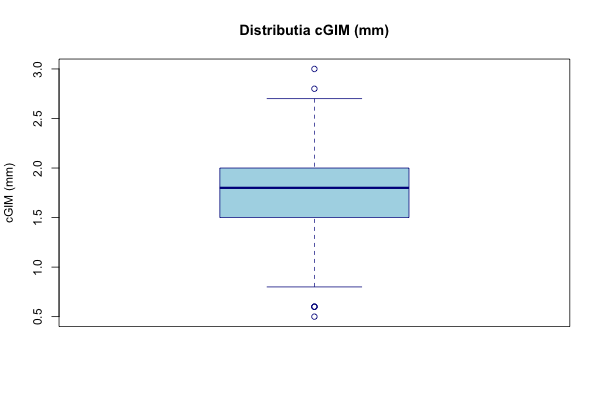

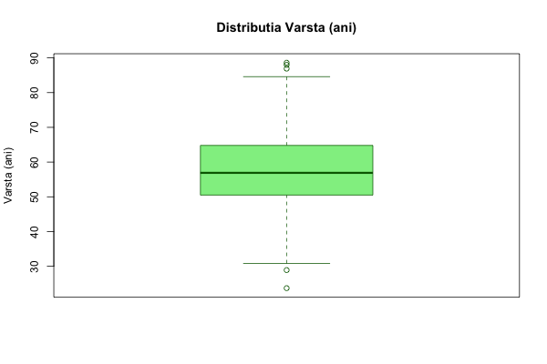

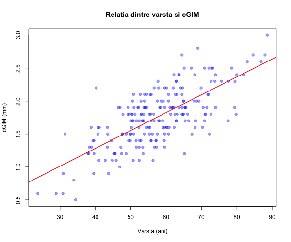

## 3. Corelația

| Statistică | Valoare |
|---|---|
| Pearson r | 0.7232 |
| t | 15.2467 |
| df | 212 |
| p-value | < 2.2e-16 |
| 95% CI | [0.6524, 0.7815] |

**Interpretare:** Există o corelație pozitivă puternică și semnificativă statistic (r = 0.723, p < 0.001) între vârstă și grosimea intima-media carotidiană.

## 4. Modelul de regresie simplă

**cGIM = 0.1974 + 0.0271 × Varsta**

### Tabelul 0 - Regresie simplă Vârstă → cGIM

| Variabilă | B | SE | IC 95% inferior | IC 95% superior | t(df) | p-value |
|---|---|---|---|---|---|---|
| (Intercept) | 0.1974 | 0.1044 | -0.0083 | 0.4032 | 1.8914(212) | 0.05994 |
| Varsta_ani | 0.0271 | 0.0018 | 0.0236 | 0.0306 | 15.2467(212) | < 2.2e-16 |

- **R²** = 0.5230
- **R² ajustat** = 0.5208

**Interpretare:** La fiecare creștere cu 1 an a vârstei, cGIM crește cu 0.027 mm (p < 0.001). Vârsta explică 52.3% din variabilitatea cGIM.

---

# Întrebarea 2 - Regresie simplă: Gen → cGIM

**Obiectiv:** Există o asociere semnificativă între gen și cGIM la pacienții cu AR?

## 1. Specificarea variabilelor

| Nume Variabilă | Tip (scala de măsurare) | Tip (relația dintre ele) |
|---|---|---|
| cGIM_mm | cantitativă continuă | variabilă dependentă |
| Gen | calitativă dihotomială (0=Femei, 1=Bărbați) | variabilă independentă |

## 2. Analiza descriptivă

**Distribuția pe gen:**

| Gen | n |
|---|---|
| Femei (0) | 118 |
| Bărbați (1) | 96 |

**cGIM per gen:**

| Gen | n | Media | SD | Mediana |
|---|---|---|---|---|
| Femei | 118 | 1.6805 | 0.3971 | 1.7000 |
| Bărbați | 96 | 1.8510 | 0.4711 | 1.8500 |

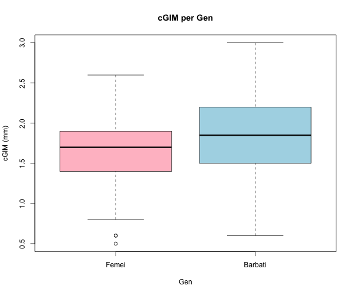

## 3. Modelul de regresie simplă

**cGIM = 1.6805 + 0.1705 × Gen**

### Tabelul 1 - Regresie simplă Gen → cGIM

| Variabilă | B | SE | IC 95% inferior | IC 95% superior | t(df) | p-value |
|---|---|---|---|---|---|---|
| (Intercept) | 1.6805 | 0.0397 | 1.6022 | 1.7589 | 42.2779(212) | < 2.2e-16 |
| Gen | 0.1705 | 0.0593 | 0.0535 | 0.2875 | 2.8735(212) | 0.004473 |

- **R²** = 0.0375
- **R² ajustat** = 0.0329

**Interpretare:** Bărbații au un cGIM semnificativ mai mare cu 0.171 mm comparativ cu femeile (p = 0.004). Genul explică doar 3.75% din variabilitatea cGIM.

---

# Întrebarea 3 - Regresie multiplă fără interacțiune

**Obiectiv:** Există o dependență liniară semnificativă între vârstă și cGIM, ajustând pentru gen și caracteristicile clinice?

## 1. Specificarea variabilelor

| Variabilă | Tip | Rol |
|---|---|---|
| cGIM_mm | cantitativă continuă | VD |
| Varsta_ani | cantitativă continuă | VI de interes |
| Gen | calitativă dihotomială | VI de interes |
| Durata_bolii_ani | cantitativă continuă | covariată |
| Medicamente_antireumatice | calitativă dihotomială | covariată |
| Medicamente_antiinfl_nesteroidiene | calitativă dihotomială | covariată |
| Corticosteroizi | calitativă dihotomială | covariată |

## 2. Statistici descriptive suplimentare

**Durata_bolii_ani:**

| Statistică | Valoare |
|---|---|
| Media | 9.3921 |
| Mediana | 7.0000 |
| SD | 9.1361 |
| Min | 0.5000 |
| Max | 47.0000 |
| Outliers | 11 |

**Variabile categoriale:**

| Variabilă | 0 (Nu) | 1 (Da) |
|---|---|---|
| Gen (F/M) | 118 | 96 |
| Medicamente_antireumatice | 53 | 161 |
| Medicamente_antiinfl_nesteroidiene | 105 | 109 |
| Corticosteroizi | 92 | 122 |

## 3. Modelul de regresie multiplă fără interacțiune

**cGIM = 0.1036 + 0.0271×Varsta + 0.0240×Gen + 0.0039×Durata_bolii + 0.0411×Med_antireum + 0.0242×Med_AINS + 0.0086×Corticosteroizi**

## 4. Testul de semnificație globală (F)

- **H0:** toți coeficienții = 0
- **H1:** cel puțin un coeficient ≠ 0
- **F** = 39.2466, **df1** = 6, **df2** = 207
- **p-value** < 2.2e-16
- **Decizie:** p < 0.05 → se respinge H0. Modelul este semnificativ statistic.

## 5. Teste individuale

### Tabelul 2 - Regresie multiplă fără interacțiune

| Variabilă | B | SE | IC 95% inf | IC 95% sup | Beta | t(df) | p-value |
|---|---|---|---|---|---|---|---|
| (Intercept) | 0.1036 | 0.1217 | -0.1364 | 0.3436 | - | 0.8508(207) | 0.3959 |
| Varsta_ani | 0.0271 | 0.0018 | 0.0235 | 0.0307 | 0.7225 | 14.6865(207) | < 2.2e-16 |
| Gen | 0.0240 | 0.0434 | -0.0615 | 0.1095 | 0.0273 | 0.5536(207) | 0.5804 |
| Durata_bolii_ani | 0.0039 | 0.0023 | -0.0007 | 0.0084 | 0.0806 | 1.6734(207) | 0.0958 |
| Med_antireumatice | 0.0411 | 0.0491 | -0.0557 | 0.1379 | 0.0405 | 0.8370(207) | 0.4035 |
| Med_antiinfl_nesteroid | 0.0242 | 0.0420 | -0.0585 | 0.1069 | 0.0276 | 0.5767(207) | 0.5648 |
| Corticosteroizi | 0.0086 | 0.0425 | -0.0753 | 0.0924 | 0.0097 | 0.2012(207) | 0.8407 |

**Coeficienți standardizați (Beta):** Vârsta are de departe cea mai mare influență standardizată (Beta = 0.7225), toate celelalte variabile având efecte neglijabile (Beta < 0.09).

**Interpretare:** Singura variabilă semnificativă statistic în modelul multiplu ajustat este **Vârsta** (B = 0.0271, p < 0.001). Genul devine nesemnificativ (p = 0.58) după ajustarea pentru celelalte variabile, sugerând că asocierea bivariată gen-cGIM era confundată de vârstă.

## 6. Coeficientul de determinare

- **R²** = 0.5322
- **R² ajustat** = 0.5186

**Interpretare:** 53.2% din variabilitatea cGIM este explicată de modelul cu toate variabilele independente.

## 7. Diagnostice model Q3

### Normalitatea reziduurilor

| Test | Statistică | p-value | Concluzie |
|---|---|---|---|
| Shapiro-Wilk | W = 0.9921 | 0.2991 | Normalitate satisfăcută |
| Kolmogorov-Smirnov | D = 0.0485 | 0.6942 | Normalitate satisfăcută |

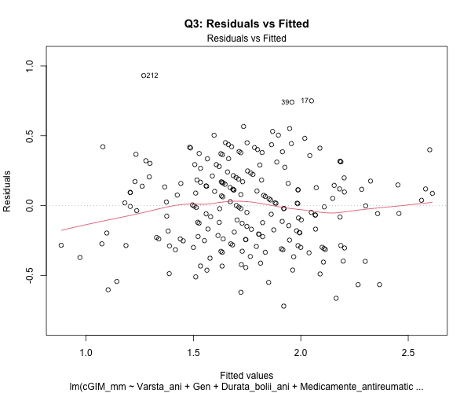
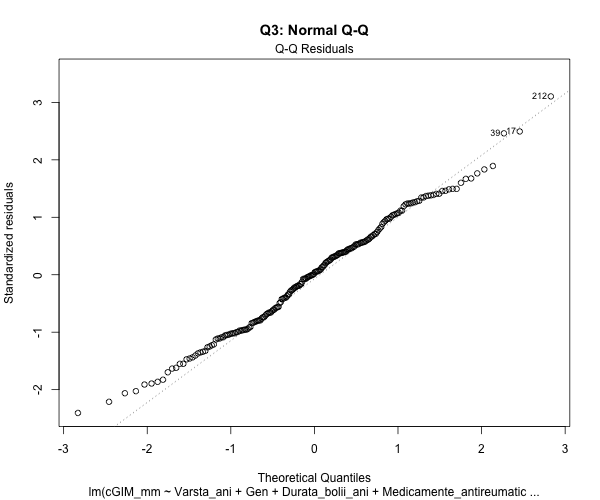
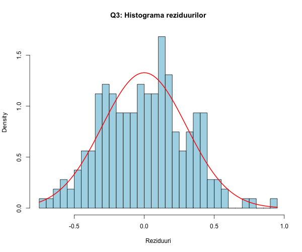

### Homoscedasticitate

| Test | Statistică | df | p-value | Concluzie |
|---|---|---|---|---|
| Breusch-Pagan | BP = 4.9528 | 6 | 0.5499 | Homoscedasticitate satisfăcută |

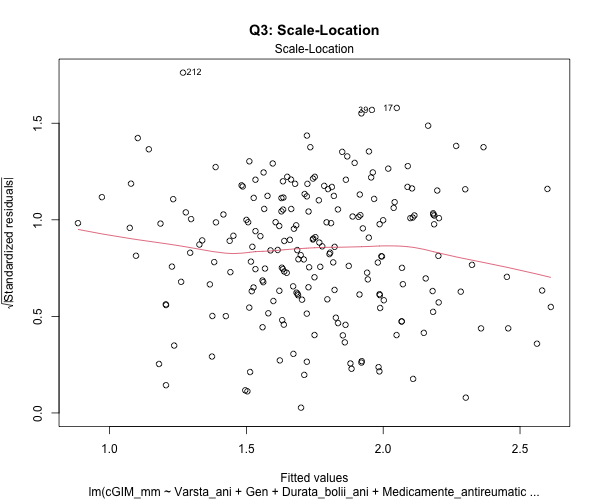

### Independența erorilor

| Test | Statistică | p-value | Concluzie |
|---|---|---|---|
| Durbin-Watson | DW = 1.6815 | 0.0082 | Posibilă autocorelație (p < 0.05) |

**Notă:** Testul Durbin-Watson indică o posibilă autocorelație a reziduurilor (p = 0.008). Aceasta poate fi datorată ordinii datelor în setul original și nu neapărat unei probleme reale de autocorelație.

### Outlieri și puncte influente

- Puncte cu Cook's D > 4/n: **10**
- Cook's D maxim: **0.0453**
- Niciun punct nu are Cook's D > 1.

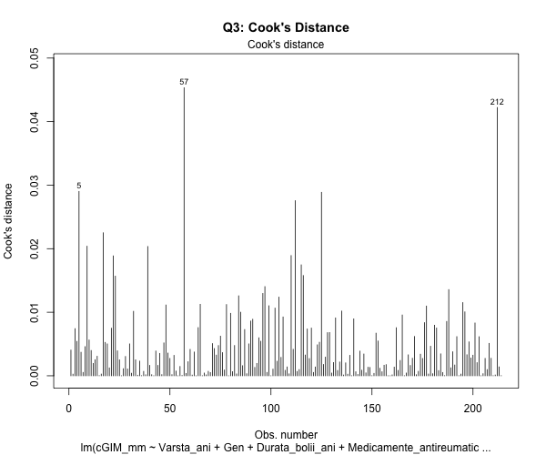
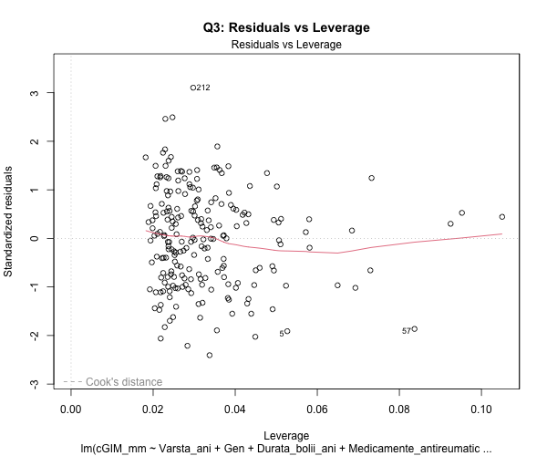

### Multicoliniaritate (VIF)

| Variabilă | VIF |
|---|---|
| Varsta_ani | 1.071 |
| Gen | 1.073 |
| Durata_bolii_ani | 1.026 |
| Med_antireumatice | 1.036 |
| Med_antiinfl_nesteroid | 1.015 |
| Corticosteroizi | 1.022 |

**Concluzie:** Toate valorile VIF < 5, nu există probleme de multicoliniaritate.

---

# Întrebarea 4 - Regresie multiplă cu interacțiune Vârstă × Gen

**Obiectiv:** Dependența liniară între vârstă și cGIM diferă semnificativ în funcție de gen, ajustând pentru covariate?

## 1. Modelul cu interacțiune

**cGIM = 0.3210 + 0.0233×Varsta - 0.4554×Gen + 0.0040×Durata_bolii + 0.0345×Med_antireum + 0.0257×Med_AINS - 0.0027×Corticosteroizi + 0.0083×Varsta×Gen**

## 2. Testul de semnificație globală (F)

- **F** = 35.0213, **df1** = 7, **df2** = 206
- **p-value** < 2.2e-16
- **Decizie:** Modelul este semnificativ statistic.

## 3. Teste individuale

### Tabelul 3 - Regresie multiplă cu interacțiune

| Variabilă | B | SE | IC 95% inf | IC 95% sup | Beta | t(df) | p-value |
|---|---|---|---|---|---|---|---|
| (Intercept) | 0.3210 | 0.1545 | 0.0163 | 0.6256 | - | 2.0769(206) | 0.0391 |
| Varsta_ani | 0.0233 | 0.0025 | 0.0184 | 0.0282 | 0.6215 | 9.3776(206) | < 2.2e-16 |
| Gen | -0.4554 | 0.2175 | -0.8843 | -0.0266 | -0.5171 | -2.0938(206) | 0.0375 |
| Durata_bolii_ani | 0.0040 | 0.0023 | -0.0005 | 0.0086 | 0.0841 | 1.7613(206) | 0.0797 |
| Med_antireumatice | 0.0345 | 0.0487 | -0.0616 | 0.1305 | 0.0340 | 0.7074(206) | 0.4801 |
| Med_antiinfl_nesteroid | 0.0257 | 0.0416 | -0.0563 | 0.1076 | 0.0293 | 0.6176(206) | 0.5375 |
| Corticosteroizi | -0.0027 | 0.0424 | -0.0863 | 0.0810 | -0.0030 | -0.0627(206) | 0.9501 |
| **Varsta_ani:Gen** | **0.0083** | **0.0037** | **0.0010** | **0.0155** | **0.5865** | **2.2485(206)** | **0.0256** |

**Coeficienți standardizați (Beta):** Vârsta rămâne cel mai important predictor (Beta = 0.6215). Termenul de interacțiune Vârstă×Gen are un efect standardizat substanțial (Beta = 0.5865), confirmând importanța sa în model.

## 4. R²

- **R²** = 0.5434
- **R² ajustat** = 0.5279

## 5. Semnificația termenului de interacțiune

- **B** = 0.0083, **SE** = 0.0037
- **t** = 2.2485, **p** = 0.0256

**Decizie:** Interacțiunea este semnificativă (p < 0.05). **Efectul vârstei asupra cGIM diferă semnificativ între bărbați și femei.**

## 6. Graficul interacțiunii

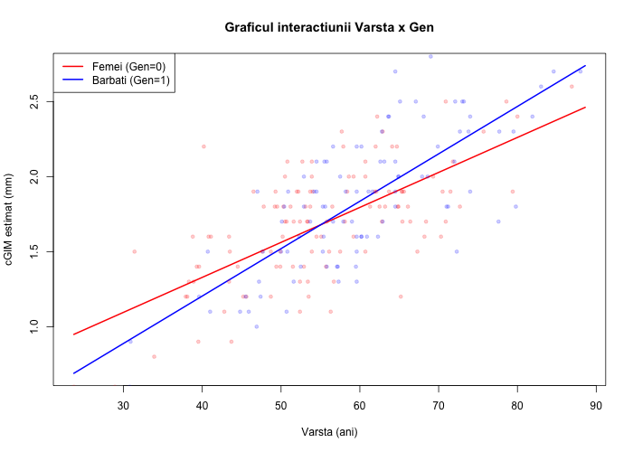

## 7. Diagnostice model Q4

| Test | Statistică | p-value | Concluzie |
|---|---|---|---|
| Shapiro-Wilk | W = 0.9945 | 0.6296 | Normalitate satisfăcută |
| Breusch-Pagan | BP = 8.5316 (df=7) | 0.2881 | Homoscedasticitate satisfăcută |
| Durbin-Watson | DW = 1.7184 | 0.0167 | Posibilă autocorelație |
| Puncte influente (Cook's D > 4/n) | 10 | - | Niciun punct cu Cook's D > 1 |

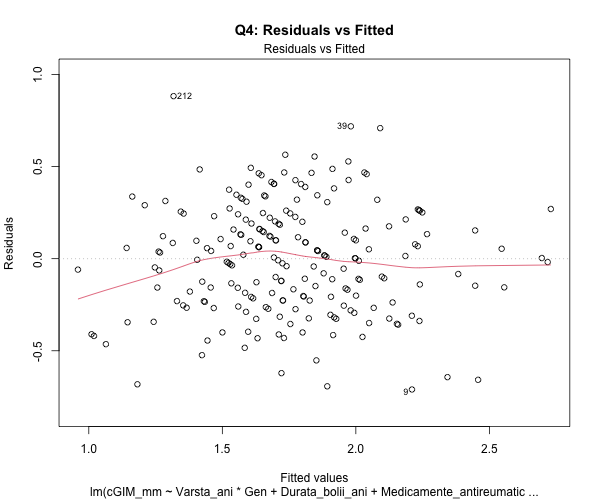
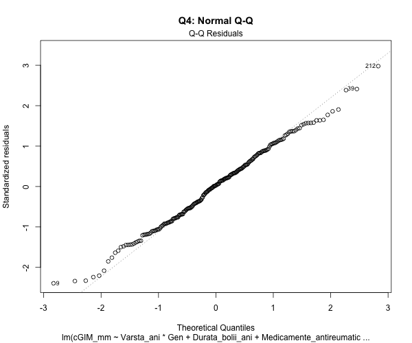
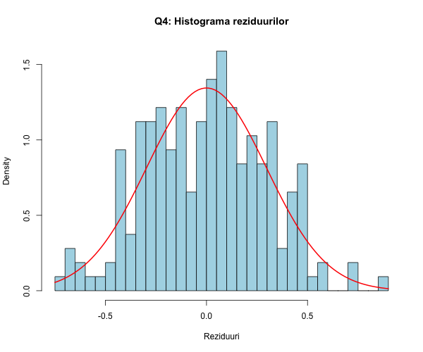
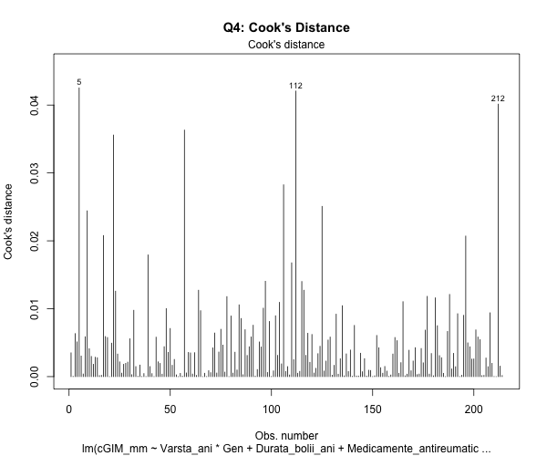

---

# Compararea modelelor nested (Q3 vs Q4)

### Tabelul 4 - Compararea modelelor

| Model | Formula | R² | R² ajustat |
|---|---|---|---|
| Q3 (fără interacțiune) | cGIM ~ Varsta + Gen + Covariate | 0.5322 | 0.5186 |
| Q4 (cu interacțiune) | cGIM ~ Varsta × Gen + Covariate | 0.5434 | 0.5279 |

**Test ANOVA pentru modele nested:**

| | Res.Df | RSS | Df | Sum of Sq | F | p-value |
|---|---|---|---|---|---|---|
| Model Q3 | 207 | 19.211 | | | | |
| Model Q4 | 206 | 18.750 | 1 | 0.4602 | 5.0557 | 0.0256 |

**Decizie:** p = 0.026 < 0.05 → Modelul cu interacțiune (Q4) este semnificativ mai bun decât modelul fără interacțiune (Q3).

---

# Interpretarea coeficienților

## Model Q3 (fără interacțiune):

- **Varsta_ani (B = 0.0271):** La fiecare creștere cu 1 an a vârstei, cGIM crește cu 0.027 mm, controlând pentru gen și caracteristicile clinice. Efectul este semnificativ (p < 0.001).
- **Gen (B = 0.0240):** Diferența de cGIM între bărbați și femei este de 0.024 mm, ajustând pentru celelalte variabile. Efectul **nu** este semnificativ (p = 0.58).

## Model Q4 (cu interacțiune):

- **Varsta_ani (B = 0.0233):** Efectul vârstei asupra cGIM **la femei** (Gen=0): la fiecare an, cGIM crește cu 0.0233 mm.
- **Gen (B = -0.4554):** La vârsta 0 (extrapolare teoretică), bărbații ar avea un cGIM cu 0.455 mm mai mic decât femeile.
- **Varsta_ani:Gen (B = 0.0083):** La bărbați, efectul vârstei asupra cGIM este cu 0.0083 mm/an mai mare decât la femei. Efectul total al vârstei la bărbați = 0.0233 + 0.0083 = **0.0316 mm/an**.
- **Interpretare practică:** Vârsta are un efect mai pronunțat asupra grosimii intima-media carotidiane la bărbați (0.032 mm/an) comparativ cu femeile (0.023 mm/an), ceea ce sugerează că bărbații cu AR au o progresie mai rapidă a aterosclerozei odată cu înaintarea în vârstă.

---

## Concluzii generale

1. Vârsta este cel mai puternic predictor al cGIM (r = 0.723, R² = 52.3% în modelul simplu).
2. Genul are un efect semnificativ biariat (p = 0.004), dar devine nesemnificativ (p = 0.58) după ajustarea pentru vârstă, sugerând confundare.
3. Modelul multiplu cu interacțiune este semnificativ mai bun decât cel fără interacțiune (p = 0.026).
4. Interacțiunea Vârstă × Gen este semnificativă: efectul vârstei asupra cGIM este mai mare la bărbați (0.032 mm/an) decât la femei (0.023 mm/an).
5. Covariatele clinice (durata bolii, medicamentele) nu au efecte semnificative independente asupra cGIM.
6. Asumpțiile modelului sunt în general satisfăcute (normalitate, homoscedasticitate, absența multicoliniarității), cu excepția unei posibile autocorelații minore (DW = 1.72).

---

## Cod R utilizat

```r
# Vezi fisierul analysis_lp06.R pentru codul complet
```
