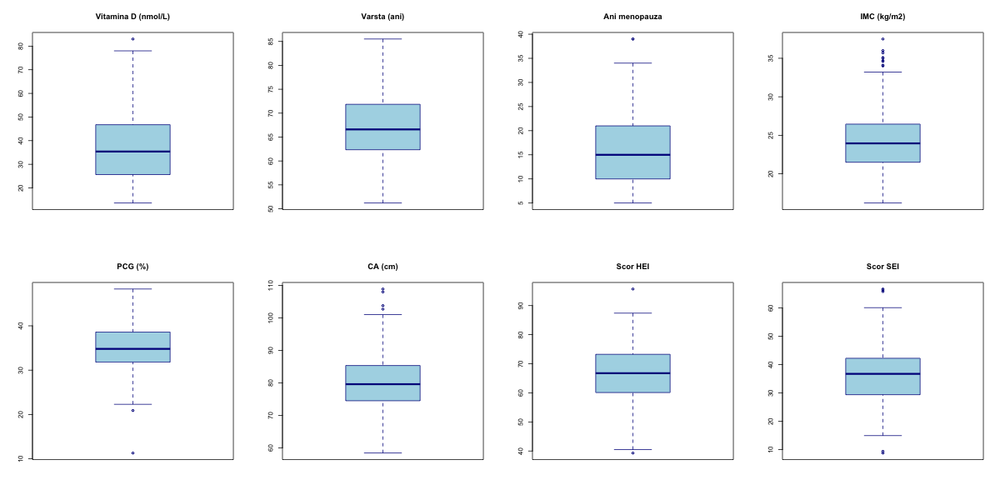
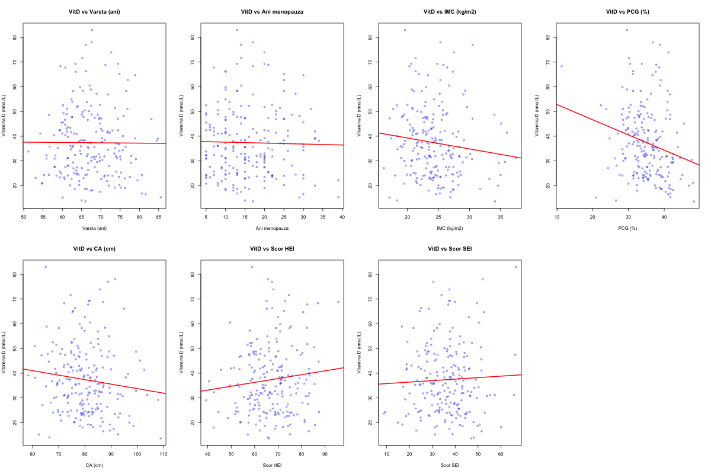
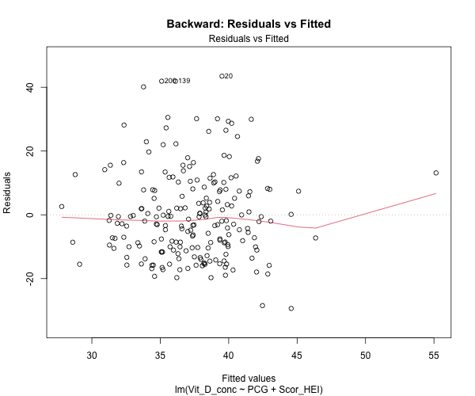
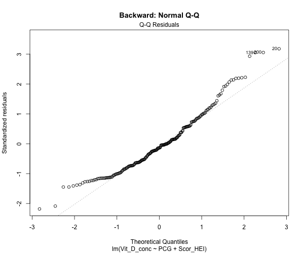
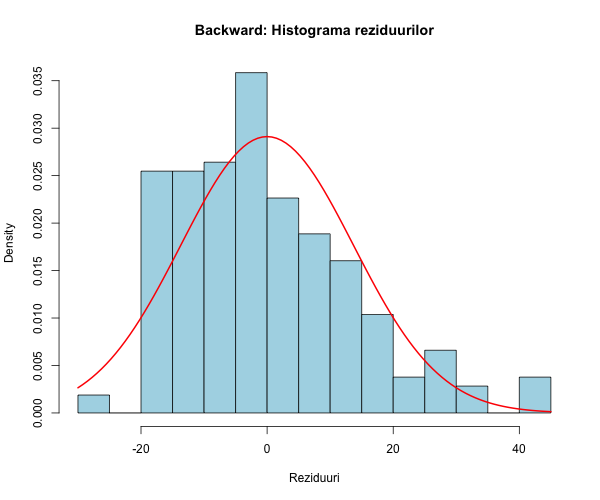
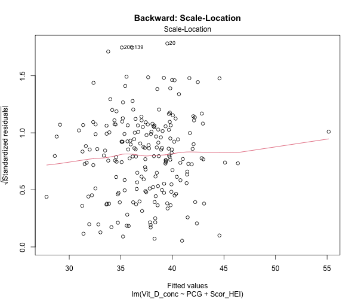
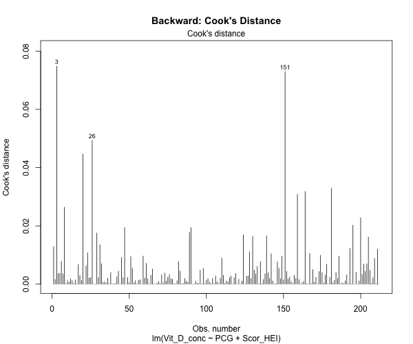
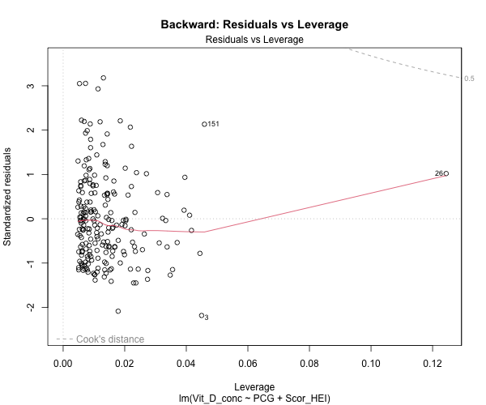

# LP07 - Regresia liniară multiplă - Selecția variabilelor independente

**Eșantion:** n = 212 femei > 50 ani
**VD:** Vit_D_conc (concentrația serică 25(OH) vitamina D, nmol/L)
**VI potențiale:** Varsta_ani, Ani_menopauza, IMC, PCG, CA, Scor_HEI, Scor_SEI
**Metode selecție:** Backward, Forward, Stepwise

---

## 1. Statistici descriptive

| Variabilă | N | Media | Mediana | SD | Min | Max | Q1 | Q3 | IQR | Outliers |
|---|---|---|---|---|---|---|---|---|---|---|
| Vit_D_conc (nmol/L) | 212 | 37.36 | 35.40 | 14.15 | 13.60 | 83.00 | 25.68 | 46.68 | 21.00 | 1 |
| Varsta_ani | 212 | 67.16 | 66.60 | 6.61 | 51.20 | 85.50 | 62.38 | 71.83 | 9.45 | 0 |
| Ani_menopauza | 212 | 16.07 | 15.00 | 7.66 | 5.00 | 39.00 | 10.00 | 21.00 | 11.00 | 2 |
| IMC (kg/m2) | 212 | 24.32 | 23.95 | 3.85 | 16.20 | 37.50 | 21.50 | 26.43 | 4.93 | 9 |
| PCG (%) | 212 | 35.10 | 34.80 | 5.18 | 11.30 | 48.30 | 31.80 | 38.60 | 6.80 | 2 |
| CA (cm) | 212 | 80.16 | 79.60 | 8.90 | 58.40 | 108.90 | 74.50 | 85.28 | 10.78 | 4 |
| Scor_HEI | 212 | 66.93 | 66.75 | 9.91 | 39.30 | 95.70 | 60.10 | 73.13 | 13.03 | 3 |
| Scor_SEI | 212 | 36.04 | 36.74 | 10.08 | 8.78 | 66.68 | 29.44 | 42.22 | 12.78 | 5 |

### Concluzia analizei descriptive:

Concentrația medie de vitamina D este de 37.36 nmol/L (SD = 14.15), ceea ce indică un nivel insuficient conform clasificării (< 50 nmol/L). Distribuția prezintă o ușoară asimetrie pozitivă (media > mediana). Femeile au o vârstă medie de 67.16 ani și o durată medie a menopauzei de 16.07 ani. IMC-ul mediu (24.32) indică normponderalitate, iar procentul mediu de grăsime corporală (35.10%) este în limite acceptabile.

### Box-plots:



### Scatter plots:



## 2. Corelații

### Matricea de corelație Pearson:

| | Vit_D | Varsta | Ani_menop | IMC | PCG | CA | HEI | SEI |
|---|---|---|---|---|---|---|---|---|
| Vit_D | 1.000 | -0.006 | -0.021 | -0.120 | **-0.225** | -0.115 | 0.109 | 0.043 |
| Varsta | -0.006 | 1.000 | **0.773** | 0.039 | 0.197 | 0.093 | -0.002 | 0.044 |
| Ani_menop | -0.021 | **0.773** | 1.000 | -0.016 | 0.036 | 0.024 | 0.026 | 0.024 |
| IMC | -0.120 | 0.039 | -0.016 | 1.000 | **0.763** | **0.854** | -0.001 | 0.012 |
| PCG | **-0.225** | 0.197 | 0.036 | **0.763** | 1.000 | **0.695** | 0.003 | 0.016 |
| CA | -0.115 | 0.093 | 0.024 | **0.854** | **0.695** | 1.000 | -0.003 | 0.006 |
| HEI | 0.109 | -0.002 | 0.026 | -0.001 | 0.003 | -0.003 | 1.000 | 0.096 |
| SEI | 0.043 | 0.044 | 0.024 | 0.012 | 0.016 | 0.006 | 0.096 | 1.000 |

### Teste de semnificație (VD vs fiecare VI):

| Variabilă | r | t | df | p-value | Semnificativ |
|---|---|---|---|---|---|
| Varsta_ani | -0.0064 | -0.0930 | 210 | 0.926 | Nu |
| Ani_menopauza | -0.0209 | -0.3035 | 210 | 0.762 | Nu |
| IMC | -0.1204 | -1.7571 | 210 | 0.080 | Nu (marginal) |
| **PCG** | **-0.2249** | **-3.3454** | **210** | **0.001** | **Da** |
| CA | -0.1146 | -1.6713 | 210 | 0.096 | Nu (marginal) |
| Scor_HEI | 0.1091 | 1.5909 | 210 | 0.113 | Nu |
| Scor_SEI | 0.0430 | 0.6237 | 210 | 0.534 | Nu |

**Interpretare:** Singura corelație semnificativă cu vitamina D este PCG (r = -0.225, p = 0.001). Se observă coliniarități puternice între variabilele antropometrice: IMC-CA (r = 0.854), IMC-PCG (r = 0.763), PCG-CA (r = 0.695), și între Varsta-Ani_menopauza (r = 0.773).

**Notă importantă privind multicoliniaritatea:** Variabilele Varsta/Ani_menopauza și IMC/PCG/CA sunt puternic corelate între ele, ceea ce justifică utilizarea metodelor de selecție a variabilelor pentru a evita redundanța.

## 3. Regresie liniară simplă pentru fiecare factor

### Tabelul 0 - Regresie simplă

| Variabilă | B | SE | IC 95% inferior | IC 95% superior | t(df) | p-value | R² |
|---|---|---|---|---|---|---|---|
| Varsta_ani | -0.0137 | 0.1478 | -0.3051 | 0.2776 | -0.0930(210) | 0.926 | 0.0000 |
| Ani_menopauza | -0.0387 | 0.1274 | -0.2899 | 0.2125 | -0.3035(210) | 0.762 | 0.0004 |
| IMC | -0.4422 | 0.2517 | -0.9384 | 0.0539 | -1.7571(210) | 0.080 | 0.0145 |
| **PCG** | **-0.6149** | **0.1838** | **-0.9773** | **-0.2526** | **-3.3454(210)** | **0.001** | **0.0506** |
| CA | -0.1823 | 0.1091 | -0.3973 | 0.0327 | -1.6713(210) | 0.096 | 0.0131 |
| Scor_HEI | 0.1559 | 0.0980 | -0.0373 | 0.3490 | 1.5909(210) | 0.113 | 0.0119 |
| Scor_SEI | 0.0604 | 0.0968 | -0.1304 | 0.2512 | 0.6237(210) | 0.534 | 0.0018 |

**Interpretare:** Doar PCG are o asociere semnificativă univariată cu vitamina D (B = -0.615, p = 0.001), explicând 5.1% din variabilitate. La fiecare creștere cu 1% a PCG, vitamina D scade cu 0.615 nmol/L.

---

## 4. Regresie multiplă - Backward selection

### Procedura Backward:

Model inițial: toate 7 VI → eliminare secvențială: CA → Scor_SEI → Ani_menopauza → Varsta_ani → IMC

**Model final Backward: Vit_D ~ PCG + Scor_HEI**

### Tabelul 1 - Backward selection

| Variabilă | B | SE | IC 95% inf | IC 95% sup | Beta | t(df) | p-value |
|---|---|---|---|---|---|---|---|
| (Intercept) | 48.4847 | 9.1069 | 30.5316 | 66.4378 | - | 5.3240(209) | 2.612e-07 |
| PCG | -0.6159 | 0.1831 | -0.9768 | -0.2549 | -0.2253 | -3.3638(209) | 0.0009 |
| Scor_HEI | 0.1568 | 0.0956 | -0.0317 | 0.3454 | 0.1098 | 1.6397(209) | 0.103 |

- **R²** = 0.0627
- **R² ajustat** = 0.0537
- **F** = 6.985 pe 2 și 209 df, **p** = 0.001157

### Diagnostice model Backward:

| Test | Statistică | p-value | Concluzie |
|---|---|---|---|
| Shapiro-Wilk | W = 0.9533 | 2.165e-06 | Normalitate nesatisfăcută |
| KS test | D = 0.0877 | 0.077 | Normalitate marginală |
| Breusch-Pagan | BP = 0.9436 (df=2) | 0.624 | Homoscedasticitate satisfăcută |
| Durbin-Watson | DW = 2.2758 | 0.976 | Independență satisfăcută |
| Puncte influente (Cook's D > 4/n) | 12 | - | Cook's D max = 0.075 |
| VIF PCG | 1.000 | - | Fără multicoliniaritate |
| VIF Scor_HEI | 1.000 | - | Fără multicoliniaritate |








**Notă:** Testul Shapiro-Wilk respinge normalitatea reziduurilor (p < 0.001). Aceasta poate fi datorată prezenței unor valori extreme. Cu toate acestea, pentru eșantioane mari (n > 30), modelul de regresie este robust la încălcări ușoare ale normalității conform teoremei limitei centrale.

---

## 5. Regresie multiplă - Forward selection

### Procedura Forward:

Model inițial: niciun predictor → adăugare secvențială: PCG → Scor_HEI → STOP

**Model final Forward: Vit_D ~ PCG + Scor_HEI** (identic cu Backward)

### Tabelul 2 - Forward selection

| Variabilă | B | SE | IC 95% inf | IC 95% sup | Beta | t(df) | p-value |
|---|---|---|---|---|---|---|---|
| (Intercept) | 48.4847 | 9.1069 | 30.5316 | 66.4378 | - | 5.3240(209) | 2.612e-07 |
| PCG | -0.6159 | 0.1831 | -0.9768 | -0.2549 | -0.2253 | -3.3638(209) | 0.0009 |
| Scor_HEI | 0.1568 | 0.0956 | -0.0317 | 0.3454 | 0.1098 | 1.6397(209) | 0.103 |

- **R²** = 0.0627
- **R² ajustat** = 0.0537

---

## 6. Regresie multiplă - Stepwise selection

### Procedura Stepwise:

Model inițial: niciun predictor → PCG → Scor_HEI → STOP

**Model final Stepwise: Vit_D ~ PCG + Scor_HEI** (identic cu Backward și Forward)

### Tabelul 3 - Stepwise selection

| Variabilă | B | SE | IC 95% inf | IC 95% sup | Beta | t(df) | p-value |
|---|---|---|---|---|---|---|---|
| (Intercept) | 48.4847 | 9.1069 | 30.5316 | 66.4378 | - | 5.3240(209) | 2.612e-07 |
| PCG | -0.6159 | 0.1831 | -0.9768 | -0.2549 | -0.2253 | -3.3638(209) | 0.0009 |
| Scor_HEI | 0.1568 | 0.0956 | -0.0317 | 0.3454 | 0.1098 | 1.6397(209) | 0.103 |

- **R²** = 0.0627
- **R² ajustat** = 0.0537

---

## 7. Comparație modele

| Model | Variabile selectate | R² | R² ajustat |
|---|---|---|---|
| Backward | PCG, Scor_HEI | 0.0627 | 0.0537 |
| Forward | PCG, Scor_HEI | 0.0627 | 0.0537 |
| Stepwise | PCG, Scor_HEI | 0.0627 | 0.0537 |
| Full (toate 7 VI) | Toate | 0.0801 | 0.0486 |

**Interpretare:** Toate cele trei metode de selecție converg la același model final cu 2 predictori: **PCG** și **Scor_HEI**. Modelul redus (R² ajustat = 0.054) are un R² ajustat superior modelului complet (R² ajustat = 0.049), confirmând că eliminarea variabilelor redundante îmbunătățește eficiența modelului.

---

## 8. Interpretarea modelului final

**Vit_D = 48.48 - 0.62 × PCG + 0.16 × Scor_HEI**

### Coeficienți nestandardizați (B):

- **Intercept (B0 = 48.48):** Concentrația estimată de vitamina D când PCG = 0% și HEI = 0 (extrapolare teoretică).
- **PCG (B = -0.6159):** La fiecare creștere cu 1% a procentului de grăsime corporală, concentrația de vitamina D scade cu 0.62 nmol/L, controlând pentru calitatea dietei. Efectul este **semnificativ** (p = 0.001).
- **Scor_HEI (B = 0.1568):** La fiecare creștere cu 1 punct a scorului HEI, concentrația de vitamina D crește cu 0.16 nmol/L, controlând pentru PCG. Efectul este **nesemnificativ** la pragul convențional (p = 0.103), dar este reținut de procedura AIC.

### Coeficienți standardizați (Beta):

- **PCG:** Beta = -0.2253 (cel mai important predictor)
- **Scor_HEI:** Beta = 0.1098

### Coeficientul de determinare:

R² = 0.0627 → doar 6.3% din variabilitatea concentrației serice de vitamina D este explicată de modelul cu PCG și Scor_HEI. Aceasta indică faptul că alți factori nemăsurați (expunere solară efectivă, suplimentare, factori genetici) contribuie semnificativ la variabilitatea vitaminei D.

---

## Concluzii generale

1. **PCG (procentul de grăsime corporală)** este singurul predictor semnificativ al concentrației de vitamina D (r = -0.225, p = 0.001), cu un efect negativ: grăsimea corporală mai mare se asociază cu vitamina D mai scăzută.
2. Toate cele trei metode de selecție (Backward, Forward, Stepwise) selectează același model cu 2 predictori: **PCG** și **Scor_HEI**.
3. Puterea explicativă a modelului este modestă (R² = 6.3%), sugerând existența altor factori importanți neincludi în studiu.
4. Variabilele demografice (vârstă, ani de menopauză) și indicele de expunere solară (SEI) nu contribuie semnificativ la variabilitatea vitaminei D în acest eșantion.
5. Multicoliniaritatea ridicată între variabilele antropometrice (IMC, PCG, CA) face ca doar una dintre ele (PCG) să fie reținută în modelul final.

---

## Cod R utilizat

```r
# Vezi fisierul analysis_lp07.R pentru codul complet
```
