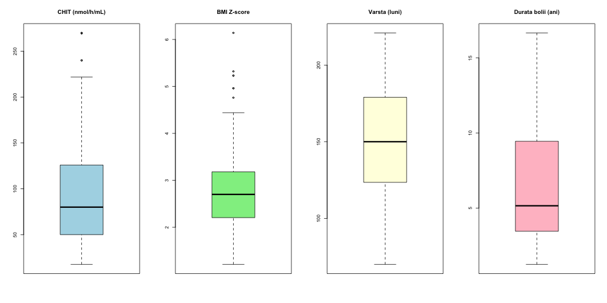
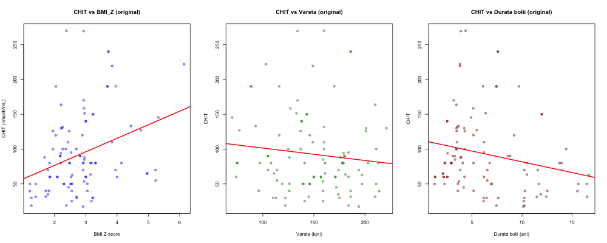
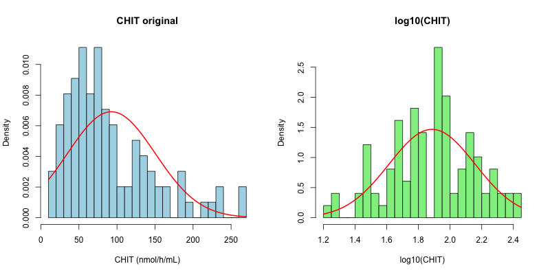
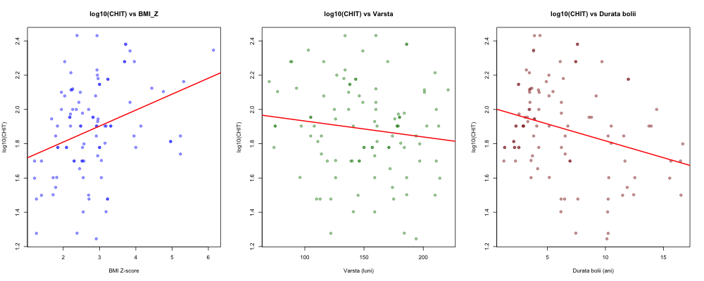
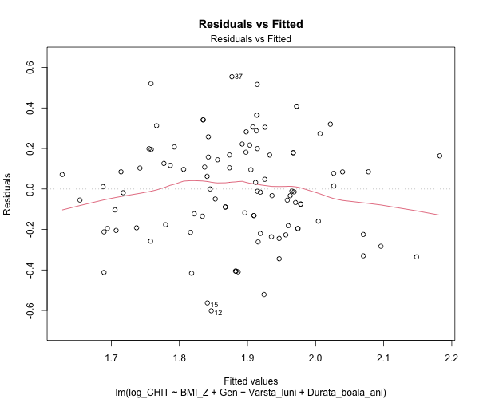
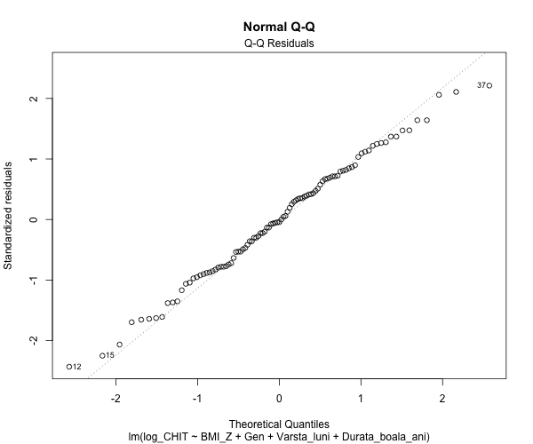
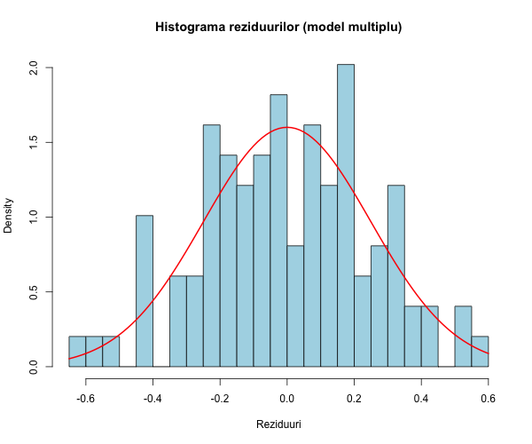
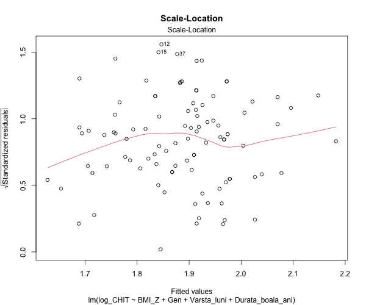
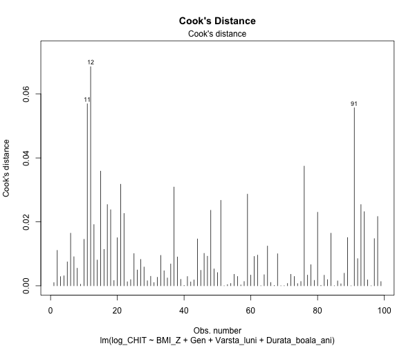
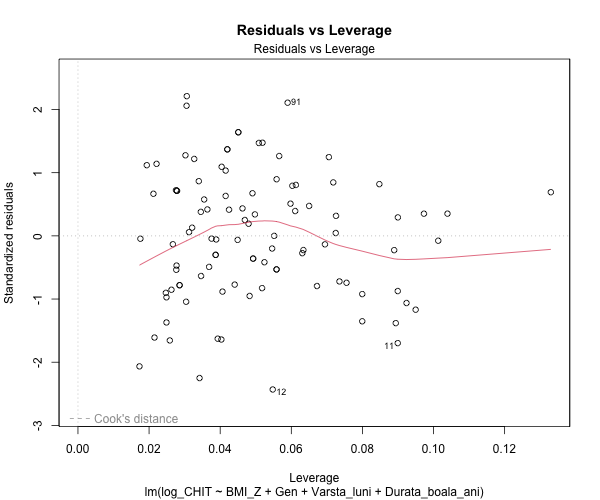

# LP08 - Regresia liniară simplă și multiplă pe date transformate

**Eșantion:** n = 99 copii/adolescenți supraponderali/obezi (5-18 ani)
**VD:** CHIT (activitatea chitotriosidazei plasmatice, nmol/h/mL) → transformată log10(CHIT)
**VI simplu:** BMI_Z (scor Z al IMC)
**VI multiplu:** BMI_Z, Gen, Varsta_luni, Durata_boala_ani

---

## 1. Statistici descriptive

| Variabilă | N | Media | Mediana | SD | Min | Max | Q1 | Q3 | IQR | Outliers |
|---|---|---|---|---|---|---|---|---|---|---|
| CHIT (nmol/h/mL) | 99 | 92.63 | 80.00 | 57.70 | 17.58 | 270.00 | 50.00 | 125.89 | 75.89 | 4 |
| BMI_Z | 99 | 2.82 | 2.70 | 0.96 | 1.21 | 6.14 | 2.21 | 3.18 | 0.98 | 7 |
| Varsta (luni) | 99 | 149.99 | 150.00 | 37.27 | 70.00 | 221.00 | 123.50 | 179.00 | 55.50 | 0 |
| Durata bolii (ani) | 99 | 6.48 | 5.15 | 4.02 | 1.25 | 16.67 | 3.45 | 9.45 | 5.99 | 0 |

**Gen:** 39 fete (0), 60 băieți (1)

### Concluzia analizei descriptive:

Activitatea medie CHIT este de 92.63 nmol/h/mL (SD = 57.70), cu o distribuție puternic asimetrică pozitivă (media >> mediana = 80.00). Scorul Z mediu al IMC este 2.82 (SD = 0.96), confirmând supraponderalitate/obezitate. Se observă 4 outlieri pentru CHIT și 7 pentru BMI_Z. Nu există valori lipsă.

### Box-plots:



### Scatter plots (date originale):



## 2. Corelații (date originale)

| Pereche | r | t | df | p-value | Semnificativ |
|---|---|---|---|---|---|
| CHIT vs BMI_Z | **0.3241** | **3.3739** | **97** | **0.001** | **Da** |
| CHIT vs Varsta_luni | -0.1152 | -1.1424 | 97 | 0.256 | Nu |
| CHIT vs Durata_boala_ani | **-0.2151** | **-2.1692** | **97** | **0.033** | **Da** |
| CHIT vs Gen | 0.1053 | 1.0427 | 97 | 0.300 | Nu |

**Interpretare:** BMI_Z și CHIT sunt corelate pozitiv semnificativ (r = 0.324, p = 0.001): un scor Z al IMC mai mare se asociază cu o activitate CHIT mai mare. Durata bolii corelează negativ cu CHIT (r = -0.215, p = 0.033).

---

## 3. Necesitatea transformării datelor

### Testul de normalitate pe CHIT original:

| Test | Statistică | p-value |
|---|---|---|
| Shapiro-Wilk | W = 0.8938 | 8.158e-07 |

- **Skewness** = 1.1651 (asimetrie pozitivă puternică)
- **Concluzie:** Distribuția CHIT **nu** este normală (p < 0.001). CHIT prezintă o distribuție puternic asimetrică pozitivă, ceea ce justifică utilizarea transformării logaritmice log10.

### Transformare log10(CHIT):

| Statistică | CHIT original | log10(CHIT) |
|---|---|---|
| Media | 92.63 | 1.886 |
| Mediana | 80.00 | 1.903 |
| SD | 57.70 | 0.272 |
| Shapiro-Wilk W | 0.8938 | **0.9868** |
| Shapiro-Wilk p | 8.16e-07 | **0.432** |
| Outliers | 4 | **0** |

**Concluzie:** Transformarea log10 normalizează cu succes distribuția CHIT (W = 0.987, p = 0.432).



### Scatter plots (date transformate):



## 4. Comparație date originale vs transformate

| Criteriu | CHIT original | log10(CHIT) |
|---|---|---|
| R² (regresie simplă ~ BMI_Z) | 0.1050 | **0.1086** |
| Shapiro-Wilk reziduuri (W) | 0.9243 | **0.9918** |
| Shapiro-Wilk reziduuri (p) | 2.634e-05 | **0.815** |

**Concluzie:** Datele transformate (log10) sunt mai adecvate pentru regresia liniară deoarece reziduurile au o distribuție normală (p = 0.815 vs p < 0.001 pentru date originale), iar R² este ușor mai mare.

---

## 5. Regresie liniară simplă - log10(CHIT) ~ BMI_Z

**Obiectiv 1:** Există o dependență liniară semnificativă între CHIT și scorul Z al IMC?

**log10(CHIT) = 1.6234 + 0.0932 × BMI_Z**

### Tabelul 0 - Regresie simplă

| Variabilă | B | SE | IC 95% inferior | IC 95% superior | t(df) | p-value |
|---|---|---|---|---|---|---|
| (Intercept) | 1.6234 | 0.0807 | 1.4633 | 1.7835 | 20.1279(97) | < 2.2e-16 |
| BMI_Z | 0.0932 | 0.0271 | 0.0394 | 0.1469 | 3.4381(97) | 0.0009 |

- **R²** = 0.1086
- **R² ajustat** = 0.0994
- **F** = 11.82 pe 1 și 97 df, **p** = 0.0009

### Interpretare:

La fiecare creștere cu 1 unitate a scorului Z al IMC, log10(CHIT) crește cu 0.093 unități (p < 0.001). Aceasta corespunde unei multiplicări a CHIT cu 10^0.093 = **1.24** (creștere cu ~24%). BMI_Z explică 10.9% din variabilitatea log10(CHIT).

**Decizie:** Se respinge H0 (p = 0.0009). Există o relație liniară semnificativă pozitivă între scorul Z al IMC și activitatea chitotriosidazei plasmatice.

---

## 6. Regresie multiplă - log10(CHIT) ~ BMI_Z + Gen + Varsta_luni + Durata_boala_ani

**Obiectiv 2:** Dependența dintre statusul ponderal și variabilitatea CHIT este semnificativă independent de gen, vârstă și durata bolii?

**log10(CHIT) = 1.6571 + 0.0819×BMI_Z + 0.0225×Gen + 0.0006×Varsta_luni - 0.0163×Durata_boala_ani**

### Test F global:

- **F** = 4.4512, **df1** = 4, **df2** = 94
- **p** = 0.002444
- **Decizie:** Modelul multiplu este semnificativ statistic (p < 0.01).

### Tabelul 1 - Regresie multiplă

| Variabilă | B | SE | IC 95% inf | IC 95% sup | Beta | t(df) | p-value |
|---|---|---|---|---|---|---|---|
| (Intercept) | 1.6571 | 0.1725 | 1.3146 | 1.9996 | - | 9.6067(94) | 1.26e-15 |
| BMI_Z | 0.0819 | 0.0310 | 0.0205 | 0.1434 | 0.2899 | 2.6467(94) | 0.010 |
| Gen | 0.0225 | 0.0541 | -0.0850 | 0.1299 | 0.0406 | 0.4153(94) | 0.679 |
| Varsta_luni | 0.0006 | 0.0008 | -0.0010 | 0.0022 | 0.0822 | 0.7539(94) | 0.453 |
| Durata_boala_ani | -0.0163 | 0.0069 | -0.0300 | -0.0026 | -0.2409 | -2.3583(94) | 0.020 |

- **R²** = 0.1592
- **R² ajustat** = 0.1235

### Interpretare coeficienților:

**Coeficienți nestandardizați (B):**

- **BMI_Z (B = 0.0819):** La creșterea cu 1 unitate a scorului Z al IMC, log10(CHIT) crește cu 0.082, controlând pentru gen, vârstă și durata bolii. Aceasta corespunde unei multiplicări a CHIT cu 10^0.082 = **1.21** (creștere cu ~21%). Efectul este **semnificativ** (p = 0.010).
- **Gen (B = 0.0225):** Băieții au un log10(CHIT) cu 0.023 mai mare decât fetele, dar efectul **nu** este semnificativ (p = 0.679).
- **Varsta_luni (B = 0.0006):** Efectul vârstei nu este semnificativ (p = 0.453).
- **Durata_boala_ani (B = -0.0163):** La fiecare an suplimentar de boală, log10(CHIT) scade cu 0.016, ceea ce corespunde unei reduceri a CHIT cu factor 10^0.016 = 0.96 (-4%/an). Efectul este **semnificativ** (p = 0.020).

**Coeficienți standardizați (Beta):**

- BMI_Z: Beta = 0.2899 (cel mai important predictor pozitiv)
- Durata_boala_ani: Beta = -0.2409 (al doilea predictor important, negativ)
- Varsta_luni: Beta = 0.0822 (nesemnificativ)
- Gen: Beta = 0.0406 (nesemnificativ)

**Coeficientul de determinare:** R² = 0.1592 → 15.9% din variabilitatea log10(CHIT) este explicată de modelul multiplu, o îmbunătățire față de modelul simplu (R² = 10.9%).

---

## 7. Diagnostice model multiplu

### Normalitatea reziduurilor:

| Test | Statistică | p-value | Concluzie |
|---|---|---|---|
| Shapiro-Wilk | W = 0.9920 | 0.827 | Normalitate satisfăcută |
| KS test | D = 0.0466 | 0.983 | Normalitate satisfăcută |





### Homoscedasticitate:

| Test | Statistică | df | p-value | Concluzie |
|---|---|---|---|---|
| Breusch-Pagan | BP = 1.6076 | 4 | 0.807 | Homoscedasticitate satisfăcută |



### Independența erorilor:

| Test | Statistică | p-value | Concluzie |
|---|---|---|---|
| Durbin-Watson | DW = 1.6680 | 0.040 | Posibilă autocorelație (marginal) |

### Outlieri și puncte influente:

- Puncte cu Cook's D > 4/n: **3**
- Cook's D maxim: **0.0685**
- Niciun punct nu depășește Cook's D > 1.




### Multicoliniaritate (VIF):

| Variabilă | VIF |
|---|---|
| BMI_Z | 1.341 |
| Gen | 1.068 |
| Varsta_luni | 1.328 |
| Durata_boala_ani | 1.167 |

**Concluzie:** Toate valorile VIF < 5, nu există probleme de multicoliniaritate.

### Rezumat diagnostice:

Toate asumpțiile modelului de regresie sunt satisfăcute: normalitatea reziduurilor (p = 0.83), homoscedasticitate (p = 0.81), absența multicoliniarității (VIF < 1.35). Testul Durbin-Watson indică o posibilă autocorelație marginală (p = 0.04), dar DW = 1.67 este aproape de valoarea ideală 2.

---

## Concluzii generale

1. **Transformarea log10 este necesară** deoarece CHIT original nu are distribuție normală (Shapiro-Wilk p < 0.001, skewness = 1.17). După transformare, normalitatea este satisfăcută (p = 0.432).
2. **Obiectiv 1:** Există o relație liniară semnificativă pozitivă între BMI_Z și log10(CHIT) (B = 0.093, p = 0.001). La fiecare unitate de creștere a scorului Z al IMC, CHIT crește cu ~24%.
3. **Obiectiv 2:** Relația BMI_Z - CHIT rămâne semnificativă (p = 0.010) după ajustarea pentru gen, vârstă și durata bolii, confirmând independența asocierii.
4. **Durata bolii** are un efect negativ semnificativ independent (p = 0.020): CHIT scade cu ~4% pentru fiecare an de boală.
5. **Gen** și **vârsta** nu au efecte semnificative independente asupra CHIT.
6. Modelul multiplu explică **15.9%** din variabilitatea log10(CHIT), superior modelului simplu (10.9%).

---

## Cod R utilizat

```r
# Vezi fisierul analysis_lp08.R pentru codul complet
```
