# LP09 - Regresia liniară multiplă - Validarea modelului

**Eșantion:** n = 212 femei > 50 ani
**VD:** Vit_D_conc (concentrația serică 25(OH) vitamina D, nmol/L)
**VI potențiale:** Varsta_ani, Ani_menopauza, IMC, PCG, CA
**Metode validare:** Train/Test Split (70%/30%), k-fold Cross-Validation (5 și 10 folduri)

---

# Partea 1 - Selectarea modelului

## 1. Statistici descriptive

| Variabilă | N | Media | Mediana | SD | Min | Max | Q1 | Q3 | IQR | Outliers |
|---|---|---|---|---|---|---|---|---|---|---|
| Vit_D_conc (nmol/L) | 212 | 32.36 | 31.15 | 9.36 | 15.20 | 58.30 | 24.48 | 38.40 | 13.93 | 0 |
| Varsta_ani (ani) | 212 | 67.16 | 66.60 | 6.61 | 51.20 | 85.50 | 62.38 | 71.83 | 9.45 | 0 |
| Ani_menopauza (ani) | 212 | 16.07 | 15.00 | 7.66 | 5.00 | 39.00 | 10.00 | 21.00 | 11.00 | 2 |
| IMC (kg/m2) | 212 | 24.32 | 24.05 | 3.64 | 16.20 | 36.00 | 21.58 | 26.63 | 5.05 | 5 |
| PCG (%) | 212 | 35.07 | 34.65 | 5.18 | 11.30 | 48.30 | 31.80 | 38.53 | 6.73 | 2 |
| CA (cm) | 212 | 80.16 | 79.60 | 8.90 | 58.40 | 108.90 | 74.50 | 85.28 | 10.78 | 4 |

### Concluzia analizei descriptive:

Concentrația medie de vitamina D este de 32.36 nmol/L (SD = 9.36), ceea ce indică un nivel insuficient conform clasificării (între 30 și 50 nmol/L). Femeile au o vârstă medie de 67.16 ani și o durată medie a menopauzei de 16.07 ani. IMC-ul mediu (24.32) indică normponderalitate, iar procentul mediu de grăsime corporală (35.07%) depășește ușor limita superioară acceptabilă (31%).

### Grafice:

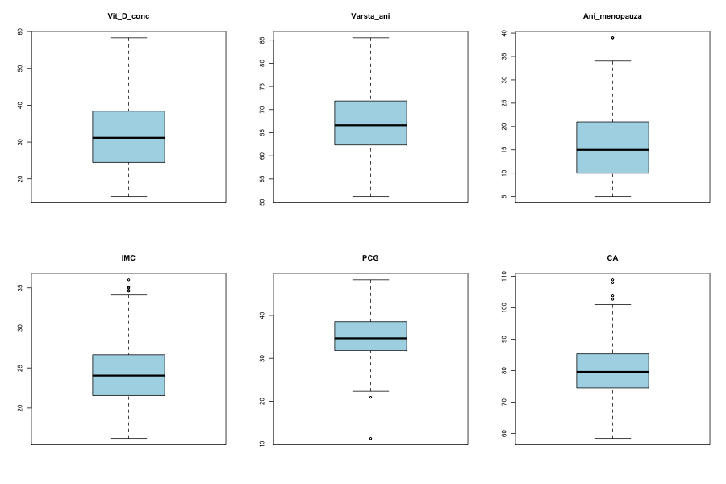

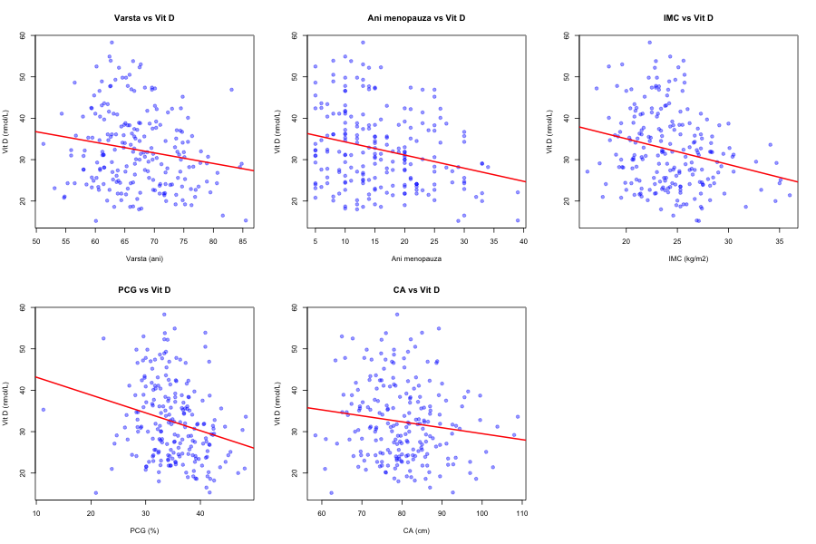

## 2. Corelații

### Matricea de corelație Pearson:

| | Varsta | Ani_menop | IMC | PCG | CA | Vit_D |
|---|---|---|---|---|---|---|
| Varsta | 1.000 | **0.773** | 0.036 | 0.198 | 0.093 | **-0.180** |
| Ani_menop | **0.773** | 1.000 | 0.014 | 0.038 | 0.024 | **-0.260** |
| IMC | 0.036 | 0.014 | 1.000 | **0.715** | **0.803** | **-0.242** |
| PCG | 0.198 | 0.038 | **0.715** | 1.000 | **0.687** | **-0.238** |
| CA | 0.093 | 0.024 | **0.803** | **0.687** | 1.000 | -0.137 |
| Vit_D | **-0.180** | **-0.260** | **-0.242** | **-0.238** | -0.137 | 1.000 |

### Teste de semnificație (VD vs fiecare VI):

| Variabilă | r | t | df | p-value | Semnificativ |
|---|---|---|---|---|---|
| Varsta_ani | -0.1801 | -2.6533 | 210 | 0.009 | Da |
| **Ani_menopauza** | **-0.2598** | **-3.8982** | **210** | **0.0001** | **Da** |
| **IMC** | **-0.2415** | **-3.6056** | **210** | **0.0004** | **Da** |
| **PCG** | **-0.2382** | **-3.5544** | **210** | **0.0005** | **Da** |
| CA | -0.1365 | -1.9973 | 210 | 0.047 | Da |

**Interpretare:** Toate variabilele sunt semnificativ corelate cu vitamina D. Cele mai puternice corelații sunt cu Ani_menopauza (r = -0.260), IMC (r = -0.242) și PCG (r = -0.238). Se observă coliniarități puternice între variabilele antropometrice: IMC-CA (r = 0.803), IMC-PCG (r = 0.715), PCG-CA (r = 0.687), și între Varsta-Ani_menopauza (r = 0.773).

## 3. Selecția variabilelor

### Backward selection:

Model inițial: toate 5 VI → eliminare: Varsta_ani → STOP

**Model final Backward: Vit_D ~ Ani_menopauza + IMC + PCG + CA**

### Forward selection:

Model inițial: niciun predictor → adăugare: Ani_menopauza → IMC → CA → PCG → STOP

**Model final Forward: Vit_D ~ Ani_menopauza + IMC + CA + PCG** (identic cu Backward)

### Stepwise selection:

**Model final Stepwise: Vit_D ~ Ani_menopauza + IMC + CA + PCG** (identic)

### Tabelul coeficienților - Modelul selectat

| Variabilă | B | SE | IC 95% inf | IC 95% sup | Beta | t(df) | p-value |
|---|---|---|---|---|---|---|---|
| (Intercept) | 47.7558 | 5.6326 | 36.6513 | 58.8604 | - | 8.4785(207) | < 0.001 |
| Ani_menopauza | -0.3111 | 0.0785 | -0.4658 | -0.1564 | -0.2547 | -3.9654(207) | 0.0001 |
| IMC | -0.7622 | 0.2990 | -1.3518 | -0.1727 | -0.2963 | -2.5489(207) | 0.0115 |
| PCG | -0.3104 | 0.1725 | -0.6504 | 0.0297 | -0.1717 | -1.7993(207) | 0.0734 |
| CA | 0.2373 | 0.1177 | 0.0052 | 0.4694 | 0.2255 | 2.0158(207) | 0.0451 |

**Coeficienți standardizați (Beta):** IMC are cel mai mare efect standardizat (Beta = -0.2963), urmat de Ani_menopauza (Beta = -0.2547), CA (Beta = 0.2255) și PCG (Beta = -0.1717). Efectele sunt relativ comparabile ca magnitudine.

- **R²** = 0.1478
- **R² ajustat** = 0.1313
- **F** = 8.975 pe 4 și 207 df, **p** = 1.054e-06

**Interpretare:** Modelul selectat include 4 predictori (Ani_menopauza, IMC, PCG, CA) și explică 14.78% din variabilitatea vitaminei D. Varsta_ani a fost eliminată din cauza coliniarității cu Ani_menopauza (r = 0.773).

## 4. Diagnostice model selectat (pe date complete)

| Test | Statistică | p-value | Concluzie |
|---|---|---|---|
| Shapiro-Wilk | W = 0.9802 | 0.0044 | Normalitate marginal nesatisfăcută |
| KS test | D = 0.0615 | 0.398 | Normalitate satisfăcută |
| Breusch-Pagan | BP = 11.3803 (df=4) | 0.0226 | Heteroscedasticitate ușoară |
| Durbin-Watson | DW = 2.2575 | 0.965 | Independență satisfăcută |
| Puncte influente (Cook's D > 4/n) | 7 | - | Cook's D max = 0.087 |

### VIF (Variance Inflation Factor):

| Variabilă | VIF |
|---|---|
| Ani_menopauza | 1.002 |
| IMC | 3.282 |
| PCG | 2.211 |
| CA | 3.038 |

**Concluzie:** Toate valorile VIF < 5, nu există probleme severe de multicoliniaritate. Normalitatea este marginal nesatisfăcută (Shapiro-Wilk p = 0.004), dar KS test este satisfăcut. Breusch-Pagan indică o ușoară heteroscedasticitate. Pentru eșantioane mari (n > 30), modelul este robust la aceste încălcări ușoare.

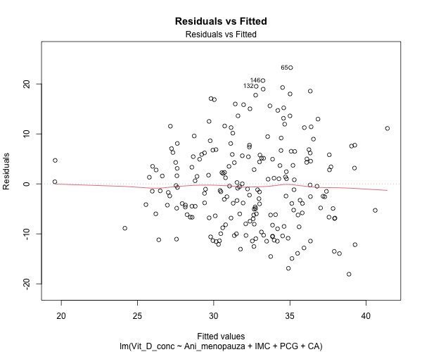
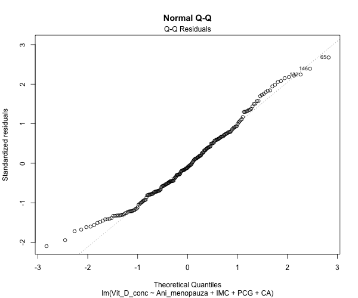
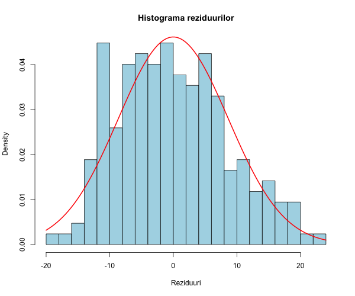
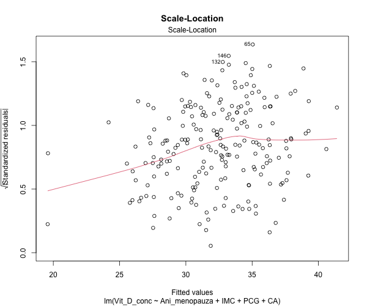
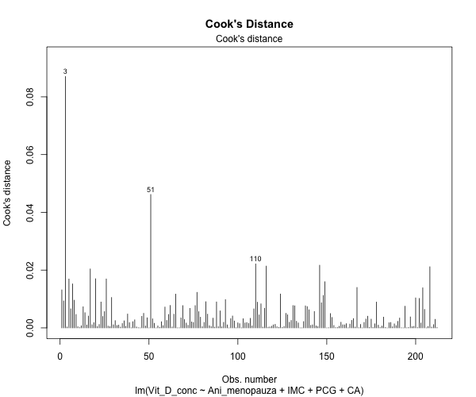

---

# Partea 2 - Validare prin împărțirea datelor (Train/Test Split 70%/30%)

## 1. Împărțirea datelor

| Set | n |
|---|---|
| Antrenare (train) | 148 (70%) |
| Testare (test) | 64 (30%) |

## 2. Modelul pe setul de antrenare

| Variabilă | B | SE | IC 95% inf | IC 95% sup | Beta | t(df) | p-value |
|---|---|---|---|---|---|---|---|
| (Intercept) | 46.3472 | 6.5755 | 33.3494 | 59.3450 | - | 7.0484(143) | < 0.001 |
| Ani_menopauza | -0.3262 | 0.0886 | -0.5014 | -0.1511 | -0.2830 | -3.6813(143) | 0.0003 |
| IMC | -0.7542 | 0.3913 | -1.5277 | 0.0192 | -0.3063 | -1.9276(143) | 0.0559 |
| PCG | -0.3815 | 0.2084 | -0.7935 | 0.0305 | -0.2167 | -1.8302(143) | 0.0693 |
| CA | 0.2901 | 0.1594 | -0.0250 | 0.6053 | 0.2880 | 1.8199(143) | 0.0709 |

- **R²** = 0.1591
- **R² ajustat** = 0.1355

## 3. Performanța comparativă Train vs Test

| Metrică | Set antrenare | Set testare |
|---|---|---|
| R² | 0.1591 | 0.1138 |
| R² ajustat | 0.1355 | 0.0537 |
| RMSE | 8.5284 | 8.8762 |
| MAE | 7.1235 | 7.0500 |

**Interpretare:** Performanța modelului pe setul de testare (R² = 0.114, RMSE = 8.88) este comparabilă cu cea de pe setul de antrenare (R² = 0.159, RMSE = 8.53). Diferența modestă între R² pe train (0.159) și R² pe test (0.114) sugerează că modelul **nu prezintă supraajustare (overfitting) semnificativă**. RMSE-ul similar pe ambele seturi (≈ 8.5-8.9 nmol/L) confirmă stabilitatea predicțiilor. MAE-ul este de asemenea comparabil (≈ 7.1 nmol/L).

### Grafice validare:

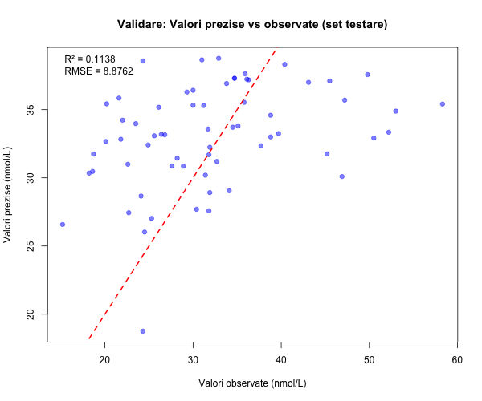

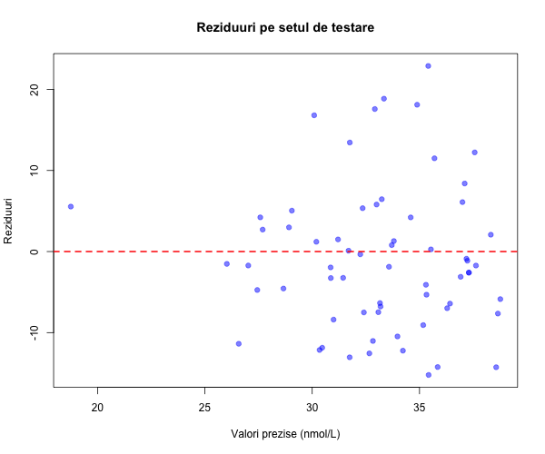

---

# Partea 3 - Validare încrucișată (Cross-Validation)

## 1. Cross-Validation cu 10 folduri

| Fold | n_train | n_test | R² | RMSE | MAE |
|---|---|---|---|---|---|
| 1 | 190 | 22 | 0.4162 | 7.0416 | 5.9803 |
| 2 | 190 | 22 | 0.0279 | 8.2184 | 6.4092 |
| 3 | 191 | 21 | 0.1149 | 7.5385 | 5.9399 |
| 4 | 191 | 21 | -0.3462 | 8.4900 | 7.3047 |
| 5 | 191 | 21 | 0.0294 | 9.8358 | 8.0793 |
| 6 | 191 | 21 | 0.0858 | 10.5806 | 8.5219 |
| 7 | 191 | 21 | 0.0874 | 9.3204 | 8.0180 |
| 8 | 191 | 21 | 0.0792 | 6.2758 | 5.4141 |
| 9 | 191 | 21 | 0.0723 | 9.9638 | 8.1609 |
| 10 | 191 | 21 | -0.1669 | 9.5470 | 8.1540 |

**Metrici medii (10-fold CV):**
- R² mediu = **0.0400** (SD = 0.1961)
- RMSE mediu = **8.6812** (SD = 1.4053)
- MAE mediu = **7.1982** (SD = 1.1510)

## 2. Cross-Validation cu 5 folduri

| Fold | n_train | n_test | R² | RMSE | MAE |
|---|---|---|---|---|---|
| 1 | 169 | 43 | 0.2287 | 8.9360 | 7.2131 |
| 2 | 169 | 43 | 0.0714 | 8.7700 | 7.2117 |
| 3 | 170 | 42 | 0.0946 | 7.0488 | 5.7639 |
| 4 | 170 | 42 | 0.0546 | 9.2627 | 7.7948 |
| 5 | 170 | 42 | -0.0245 | 9.7481 | 8.1444 |

**Metrici medii (5-fold CV):**
- R² mediu = **0.0849** (SD = 0.0920)
- RMSE mediu = **8.7531** (SD = 1.0233)
- MAE mediu = **7.2256** (SD = 0.9090)

### Grafice Cross-Validation:

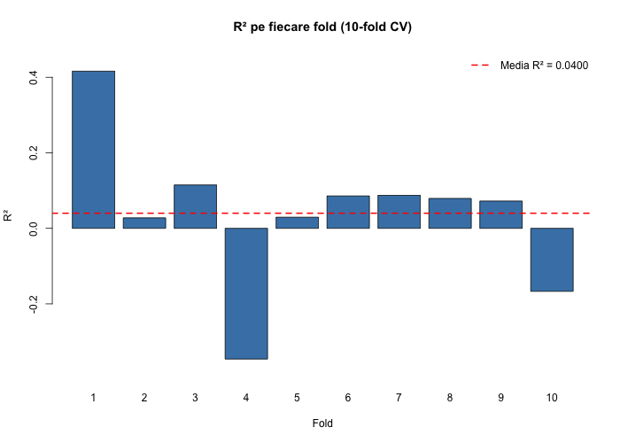

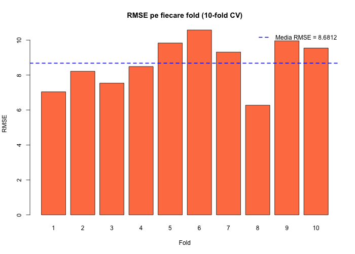

---

# Partea 4 - Comparație generală a performanțelor

| Metodă | R² | RMSE | MAE |
|---|---|---|---|
| Model complet (n=212) | 0.1478 | 8.6221 | 7.0719 |
| Train/Test - Train (70%) | 0.1591 | 8.5284 | 7.1235 |
| Train/Test - Test (30%) | 0.1138 | 8.8762 | 7.0500 |
| 10-fold CV (medie) | 0.0400 | 8.6812 | 7.1982 |
| 5-fold CV (medie) | 0.0849 | 8.7531 | 7.2256 |

---

# Interpretarea rezultatelor

## Modelul selectat:

**Vit_D = 47.76 - 0.31 × Ani_menopauza - 0.76 × IMC - 0.31 × PCG + 0.24 × CA**

- **Ani_menopauza (B = -0.311):** La fiecare an suplimentar de menopauză, vitamina D scade cu 0.31 nmol/L (p = 0.0001). Cel mai puternic predictor.
- **IMC (B = -0.762):** La fiecare creștere cu 1 kg/m² a IMC, vitamina D scade cu 0.76 nmol/L (p = 0.012).
- **PCG (B = -0.310):** La fiecare creștere cu 1% a grăsimii corporale, vitamina D scade cu 0.31 nmol/L (p = 0.073, marginal semnificativ).
- **CA (B = 0.237):** La fiecare creștere cu 1 cm a circumferinței abdominale, vitamina D crește cu 0.24 nmol/L (p = 0.045). Efectul pozitiv pare contraintuitiv, dar se explică prin controlul simultan pentru IMC și PCG (efect de supresie).

## Validarea modelului:

1. **Train/Test Split:** Performanța pe testare (R² = 0.114, RMSE = 8.88) este comparabilă cu antrenarea (R² = 0.159, RMSE = 8.53), indicând absența supraajustării semnificative.
2. **Cross-Validation:** R²-ul mediu este mai scăzut (0.04 pentru 10-fold, 0.08 pentru 5-fold), ceea ce reflectă variabilitatea mare a datelor și puterea explicativă modestă a modelului. Variabilitatea mare între folduri (SD = 0.20 pentru R²) indică instabilitate, tipică pentru modele cu R² scăzut.
3. **RMSE-ul este consistent** (~8.5-8.9 nmol/L) pe toate metodele de validare, confirmând că eroarea de predicție este stabilă.

## Concluzii:

1. Modelul selectat (Ani_menopauza + IMC + PCG + CA) este semnificativ statistic (p < 0.001) dar are o putere explicativă modestă (R² = 14.78%).
2. Validarea prin Train/Test Split confirmă absența supraajustării - performanța este similară pe date noi.
3. Cross-Validation-ul arată o performanță predictivă modestă dar stabilă în termeni de RMSE.
4. Factorii antropometrici (IMC, PCG) și durata menopauzei sunt cei mai importanți predictori ai vitaminei D la femeile peste 50 ani, dar alți factori nemăsurați (expunere solară, suplimentare, dietă) contribuie semnificativ la variabilitate.

---

## Cod R utilizat

```r
# Vezi fisierul analysis_lp09.R pentru codul complet
```
