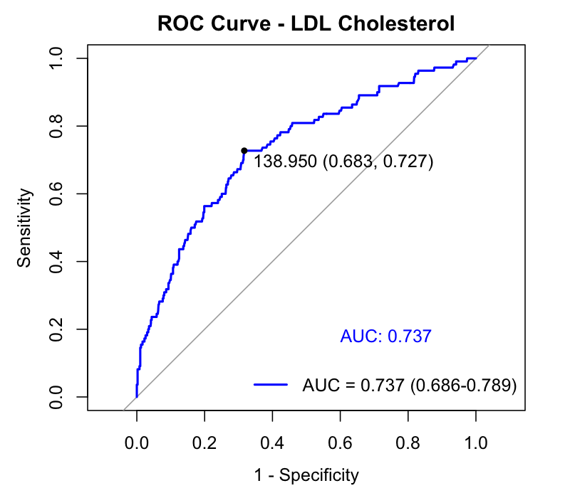
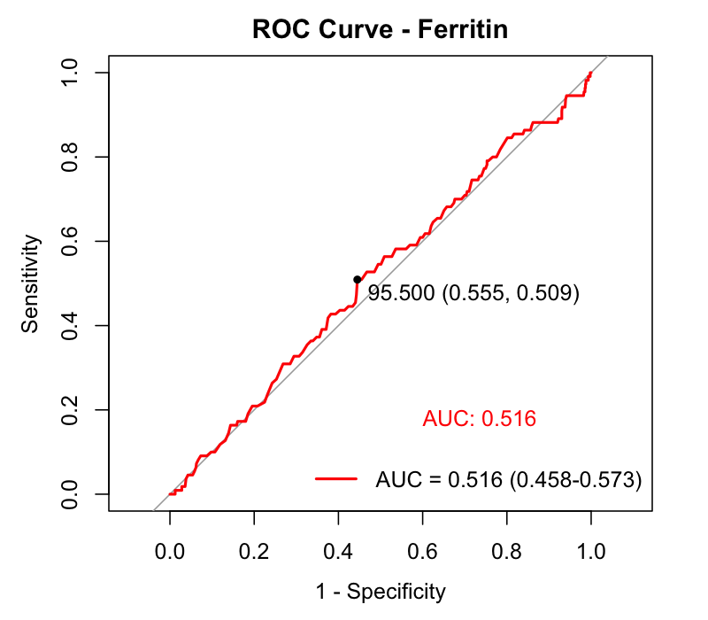

# Practica de specialitate - Analiza statistică cardiovasculară

**Variabila 1 = LDL (ldl_cholesterol)**
**Variabila 2 = Ferritin**

---

## Material and method

### Statistical analyses

Analiza statistică a fost realizată utilizând limbajul R (versiunea 4.5.2). Variabilele cantitative au fost testate pentru normalitate și, fiind non-normal distribuite, au fost prezentate ca mediană și interval intercuartilic (IQR). Variabilele categoriale au fost prezentate ca frecvențe absolute și relative (%). Comparațiile între grupuri au fost efectuate utilizând testul Mann-Whitney U pentru variabilele cantitative și testul Chi-pătrat pentru variabilele categoriale. Capacitatea discriminativă a variabilelor a fost evaluată prin analiza curbelor ROC (Receiver Operating Characteristic), cu determinarea AUC (Area Under the Curve) și a intervalelor de încredere de 95%. Punctul optim de clasificare (cut-off) a fost determinat prin metoda Youden. Regresiile logistice univariate au fost utilizate pentru estimarea odds ratio (OR) neajustat. Modelul de regresie logistică multivariată a fost construit pornind de la un model inițial cu 9 predictori selectați pe baza relevanței clinice (variabila de interes: LDL dichotomizat la mediană; variabile de ajustare: age, family_history, hypertension, diabetes, obesity, systolic_bp, HDL, triglycerides), respectând limita de grade de libertate disponibile (min(110, 890)/10 ≈ 11). Selecția finală a variabilelor a fost realizată prin eliminare progresivă (backward elimination) pe baza criteriului AIC (Akaike Information Criterion), urmată de eliminarea variabilelor nesemnificative statistic (confirmate prin testul raportului de verosimilitate). Interacțiunea LDL × family_history a fost testată pentru evaluarea unei posibile predispoziții genetice. Condițiile de aplicare au fost verificate prin testul Hosmer-Lemeshow (goodness-of-fit), VIF (multicolinearitate), testul Box-Tidwell (liniaritate în logit) și distanța Cook (observații influente). Comparația capacității discriminative între modele a fost realizată prin testul DeLong. Pragul de semnificație statistică a fost stabilit la p < 0.05.

---

## Results

### Table 1. Participants' characteristics with and without heart disease.

IQR, interquartile range

| Heart disease                     | With (n=110)          | Without (n=890)       | P      |
|-----------------------------------|-----------------------|-----------------------|--------|
| Age (years), median (IQR)         | 52.0 (37.0 - 75.8)    | 53.0 (39.0 - 74.0)    | 0.959  |
| Family History, n (%)             | 43 (39.1%)            | 204 (22.9%)           | <0.001 |
| **Comorbidities, n (%)**          |                       |                       |        |
| &emsp;hypertension                | 50 (45.5%)            | 337 (37.9%)           | 0.15   |
| &emsp;diabetes                    | 24 (21.8%)            | 161 (18.1%)           | 0.412  |
| &emsp;obesity                     | 39 (35.5%)            | 246 (27.6%)           | 0.109  |
| **Laboratory data, median (IQR)** |                       |                       |        |
| &emsp;LDL cholesterol (mg/dL)     | 154.2 (134.2 - 171.3) | 127.6 (112.9 - 145.1) | <0.001 |
| &emsp;Ferritin (ng/mL)            | 95.0 (70.0 - 138.2)   | 101.0 (71.0 - 142.8)  | 0.592  |

**Interpretare:** Pacienții cu boală cardiacă au prezentat un nivel semnificativ mai ridicat de colesterol LDL comparativ cu cei fără boală cardiacă (mediană 154.2 vs. 127.6 mg/dL, p < 0.001). De asemenea, istoricul familial de boală cardiacă a fost semnificativ mai frecvent în grupul cu boală cardiacă (39.1% vs. 22.9%, p < 0.001). Nu s-au observat diferențe semnificative statistic pentru vârstă (p = 0.959), feritină (p = 0.592), hipertensiune (p = 0.15), diabet (p = 0.412) sau obezitate (p = 0.109).

---

### Table 2. Classification of heart disease presence using receiver operating characteristic curves, based on LDL cholesterol and Ferritin.

AUC, area under the curve; CI, confidence interval; Se, sensitivity; Sp, specificity.

| Variable        | AUC (95% CI)          | Se    | Sp    | Cut-off |
|-----------------|-----------------------|-------|-------|---------|
| LDL cholesterol | 0.737 (0.686 – 0.789) | 0.727 | 0.683 | 138.9   |
| Ferritin        | 0.516 (0.458 – 0.573) | 0.509 | 0.555 | 95.5    |

---

### Figure 1. Receiver operating characteristic curves, classifying heart disease presence based on LDL cholesterol.



**Interpretare:** Curba ROC pentru colesterolul LDL demonstrează o capacitate discriminativă acceptabilă pentru clasificarea prezenței bolii cardiace, cu un AUC de 0.737 (95% CI: 0.686 - 0.789). Punctul optim de clasificare (metoda Youden) a fost identificat la 138.9 mg/dL, cu o sensibilitate de 72.7% și o specificitate de 68.3%. Aceasta înseamnă că un nivel de LDL ≥ 138.9 mg/dL identifică corect aproximativ 73% din pacienții cu boală cardiacă, excluzând în mod corect aproximativ 68% din cei fără boală.

---

### Figure 2. Receiver operating characteristic curves, classifying heart disease presence based on Ferritin.



**Interpretare:** Curba ROC pentru feritină arată o capacitate discriminativă foarte slabă, practic la nivelul întâmplării, cu un AUC de 0.516 (95% CI: 0.458 - 0.573). Intervalul de încredere include valoarea 0.5 (linia diagonală), ceea ce confirmă că feritina nu are putere de discriminare semnificativă pentru prezicerea bolii cardiace în acest eșantion.

---

### Table 3. Univariate logistic regressions predicting heart disease.

OR, odds ratio; CI, confidence interval

| Variable            | OR unadjusted | 95% CI          | p      |
|---------------------|---------------|-----------------|--------|
| age                 | 1.002         | (0.996 - 1.008) | 0.516  |
| smoking_status      | 2.233         | (1.492 - 3.336) | <0.001 |
| ldl_cholesterol     | 1.035         | (1.027 - 1.043) | <0.001 |
| ferritin            | 1.000         | (0.997 - 1.003) | 0.991  |
| family_history      | 2.158         | (1.420 - 3.253) | <0.001 |
| high_stress         | 1.668         | (1.119 - 2.485) | 0.012  |
| hypertension        | 1.367         | (0.915 - 2.036) | 0.124  |
| diabetes            | 1.264         | (0.765 - 2.020) | 0.343  |
| obesity             | 1.438         | (0.940 - 2.171) | 0.088  |
| systolic_bp         | 1.002         | (0.993 - 1.011) | 0.679  |
| diastolic_bp        | 1.003         | (0.990 - 1.015) | 0.654  |
| bmi                 | 0.947         | (0.923 - 0.971) | <0.001 |
| glucose             | 0.985         | (0.979 - 0.991) | <0.001 |
| hba1c               | 0.915         | (0.884 - 0.946) | <0.001 |
| triglycerides       | 0.993         | (0.990 - 0.996) | <0.001 |
| hdl                 | 1.030         | (1.018 - 1.042) | <0.001 |
| total_cholesterol   | 1.001         | (0.996 - 1.005) | 0.760  |
| waist_circumference | 0.983         | (0.974 - 0.992) | <0.001 |
| resting_heart_rate  | 0.995         | (0.980 - 1.010) | 0.486  |

| Model                                | OR unadjusted | 95% CI          | p      |
|--------------------------------------|---------------|-----------------|--------|
| **Model 1**                          |               |                 |        |
| &emsp;LDL >= median (129.2 mg/dL)    | 4.917         | (3.061 - 8.251) | <0.001 |
| **Model 2 - PLR**                    |               |                 |        |
| &emsp;LDL (as quantitative variable) | 1.035         | (1.027 - 1.043) | <0.001 |

**Interpretare:** În analiza univariată, variabilele semnificativ asociate cu boala cardiacă au fost: colesterolul LDL (OR = 1.035 per mg/dL, p < 0.001), fumatul (OR = 2.23, p < 0.001), istoricul familial de boală cardiacă (OR = 2.16, p < 0.001), stresul crescut (OR = 1.67, p = 0.012), HDL (OR = 1.03, p < 0.001), BMI (OR = 0.95, p < 0.001), glucoza (OR = 0.985, p < 0.001), HbA1c (OR = 0.915, p < 0.001), trigliceridele (OR = 0.993, p < 0.001) și circumferința taliei (OR = 0.983, p < 0.001). LDL dichotomizat la mediană (≥ 129.2 mg/dL) a fost puternic asociat cu boala cardiacă (OR = 4.92, p < 0.001), indicând că pacienții cu LDL peste mediană au de aproape 5 ori mai mari șansele de a avea boală cardiacă. Feritina nu a fost asociată semnificativ cu boala cardiacă (OR = 1.000, p = 0.991).

---

### Table 4. Multivariate logistic regression predicting heart disease based on LDL cholesterol and adjusted for 2 variables (backward elimination).

**Strategia de construcție a modelului:**

Modelul inițial a inclus 9 predictori (9 g.d.l. < 11 permise: min(110, 890)/10 ≈ 11) selectați pe baza relevanței clinice pentru bolile cardiovasculare: LDL ≥ mediană (variabila de interes), age, family_history, hypertension, diabetes, obesity, systolic_bp, HDL, triglycerides (AIC inițial = 614.4).

Selecția finală a fost realizată prin **backward elimination pe baza criteriului AIC**, urmată de eliminarea variabilelor nesemnificative statistic. Au fost eliminate succesiv:

1. systolic_bp (AIC: 614.4 → 613.0)
2. age (AIC: 613.0 → 611.8)
3. hypertension (AIC: 611.8 → 611.4)
4. triglycerides (AIC: 611.4 → 611.2)
5. diabetes și obesity — nesemnificative (p = 0.148 și p = 0.132), LRT confirmă că nu adaugă informație semnificativă (Chi² = 4.19, df = 2, p = 0.123), AIC comparabil (611.4 vs. 611.2)

Testul raportului de verosimilitate (LRT) a confirmat că modelul final cu 3 predictori nu pierde informație semnificativă față de modelul complet cu 9 predictori (p = 0.233, testul DeLong).

**Modelul final (3 predictori, AIC = 611.4):**

| Variable       | OR adjusted | 95% CI          | p      |
|----------------|-------------|-----------------|--------|
| LDL >= median  | 5.419       | (3.329 - 9.214) | <0.001 |
| family_history | 2.288       | (1.474 - 3.543) | <0.001 |
| HDL            | 1.032       | (1.020 - 1.045) | <0.001 |

Toți cei 3 predictori sunt semnificativi statistic (p < 0.001).

**Testarea interacțiunii LDL × family_history:**

A fost testat dacă istoricul familial de boală cardiacă amplifică efectul LDL (predispoziție genetică). Interacțiunea nu este semnificativă (OR = 0.464, 95% CI: 0.162 - 1.29, p = 0.145; LRT p = 0.143; AIC cu interacțiune = 611.3 vs. fără = 611.4). Nu există dovezi ale unei predispoziții genetice care să amplifice efectul LDL asupra bolii cardiace; cele două variabile acționează independent și aditiv pe scala log-odds.

**Verificarea condițiilor de aplicare:**

1. **Hosmer-Lemeshow test:** Chi² = 3.85, df = 8, p = 0.870. Modelul se potrivește foarte bine pe date (p > 0.05).
2. **Multicolinearitate (VIF):** Toate valorile VIF < 1.02. Nu există multicolinearitate.
3. **Liniaritate în logit (Box-Tidwell):** HDL, singura variabilă continuă din modelul final, respectă condiția de liniaritate (p = 0.977).
4. **Observații influente (Cook's Distance):** 85 observații cu Cook's D > 4/n, dar niciuna cu valori extreme care ar necesita excludere.
5. **Capacitatea discriminativă:** AUC = 0.755 (95% CI: 0.711 - 0.800) — discriminare acceptabilă. Testul DeLong confirmă că nu există diferență semnificativă față de modelul complet cu 9 predictori (AUC = 0.764, p = 0.233), validând reducerea modelului.
6. **Pseudo R² Nagelkerke:** 0.171.

**Interpretare:** În modelul multivariat final, obținut prin backward elimination și reținerea doar a variabilelor semnificative, LDL ≥ mediană rămâne cel mai puternic predictor independent al bolii cardiace (OR ajustat = 5.42, 95% CI: 3.33 - 9.21, p < 0.001), ceea ce înseamnă că pacienții cu LDL peste mediană au de aproape 5.4 ori mai mari șansele de a prezenta boală cardiacă, independent de ceilalți factori din model. Istoricul familial de boală cardiacă este al doilea predictor semnificativ (OR = 2.29, 95% CI: 1.47 - 3.54, p < 0.001), iar HDL colesterol este de asemenea semnificativ asociat (OR = 1.03 per mg/dL, 95% CI: 1.02 - 1.05, p < 0.001). Modelul cu 3 predictori este preferat celui cu 9 deoarece obține aceeași capacitate discriminativă (AUC 0.755 vs. 0.764, DeLong p = 0.233) cu o complexitate semnificativ mai redusă, o potrivire mai bună pe date (Hosmer-Lemeshow p = 0.870 vs. 0.352) și toți predictorii semnificativi.

---

## Concluzie

Colesterolul LDL reprezintă un predictor puternic și independent al bolii cardiace. În modelul multivariat final, obținut prin backward elimination din 9 predictori inițiali și reținerea doar a variabilelor semnificative, pacienții cu LDL ≥ mediană (129.2 mg/dL) au șanse de 5.4 ori mai mari de a prezenta boală cardiacă (OR = 5.42, 95% CI: 3.33 - 9.21, p < 0.001). Istoricul familial (OR = 2.29, p < 0.001) și HDL-ul (OR = 1.03/mg/dL, p < 0.001) sunt de asemenea predictori independenți semnificativi. Interacțiunea LDL × family_history nu este semnificativă (p = 0.145), indicând că efectul LDL nu este amplificat de predispoziția genetică — cele două variabile acționează independent. Capacitatea discriminativă a LDL individual, evaluată prin curba ROC, este acceptabilă (AUC = 0.737), cu un cut-off optim de 138.9 mg/dL. În contrast, feritina nu prezintă nicio asociere cu boala cardiacă (AUC = 0.516, OR = 1.00, p = 0.991). Modelul final, cu doar 3 predictori, are o capacitate discriminativă comparabilă cu modelul complet de 9 predictori (AUC 0.755 vs. 0.764, DeLong p = 0.233), se potrivește foarte bine pe date (Hosmer-Lemeshow p = 0.870) și nu prezintă multicolinearitate (VIF < 1.02), demonstrând că un model parsimonios cu toți predictorii semnificativi este preferabil.

---

## Cod R utilizat și rezultate brute

```r
library(dplyr)
library(pROC)
library(ggplot2)
library(ResourceSelection)
library(car)
library(broom)

data <- read.csv("cardiovascular_data.csv", stringsAsFactors = FALSE)

data$heart_disease <- as.factor(data$heart_disease)
data$smoking_status <- as.factor(data$smoking_status)
data$family_history <- as.factor(data$family_history)
data$high_stress <- as.factor(data$high_stress)
data$hypertension <- as.factor(data$hypertension)
data$diabetes <- as.factor(data$diabetes)
data$obesity <- as.factor(data$obesity)
data$ckd <- as.factor(data$ckd)
data$copd <- as.factor(data$copd)
data$stroke_history <- as.factor(data$stroke_history)
data$cancer_history <- as.factor(data$cancer_history)
data$liver_disease <- as.factor(data$liver_disease)
data$mental_health_issue <- as.factor(data$mental_health_issue)

with_hd <- data %>% filter(heart_disease == "1")
without_hd <- data %>% filter(heart_disease == "0")

# TABLE 1: Participant Characteristics
median_iqr <- function(x) {
  sprintf("%.1f (%.1f - %.1f)", median(x, na.rm = TRUE),
          quantile(x, 0.25, na.rm = TRUE), quantile(x, 0.75, na.rm = TRUE))
}

n_pct <- function(x, level = "1") {
  n <- sum(x == level, na.rm = TRUE)
  sprintf("%d (%.1f%%)", n, n / length(x) * 100)
}

age_test <- wilcox.test(age ~ heart_disease, data = data)
fh_test <- chisq.test(table(data$heart_disease, data$family_history))
ht_test <- chisq.test(table(data$heart_disease, data$hypertension))
diab_test <- chisq.test(table(data$heart_disease, data$diabetes))
ob_test <- chisq.test(table(data$heart_disease, data$obesity))
ldl_test <- wilcox.test(ldl_cholesterol ~ heart_disease, data = data)
fer_test <- wilcox.test(ferritin ~ heart_disease, data = data)

# TABLE 2: ROC Analysis
hd_numeric <- as.numeric(as.character(data$heart_disease))

roc_ldl <- roc(hd_numeric, data$ldl_cholesterol, quiet = TRUE)
auc_ldl <- auc(roc_ldl)
ci_ldl <- ci.auc(roc_ldl)
coords_ldl <- coords(roc_ldl, "best", best.method = "youden",
                     ret = c("threshold", "sensitivity", "specificity"))

roc_fer <- roc(hd_numeric, data$ferritin, quiet = TRUE)
auc_fer <- auc(roc_fer)
ci_fer <- ci.auc(roc_fer)
coords_fer <- coords(roc_fer, "best", best.method = "youden",
                     ret = c("threshold", "sensitivity", "specificity"))

png("figure1_roc_ldl.png", width = 800, height = 700, res = 150)
plot(roc_ldl, main = "ROC Curve - LDL Cholesterol", col = "blue", lwd = 2,
     print.auc = TRUE, print.auc.x = 0.4, print.auc.y = 0.2,
     print.thres = TRUE, print.thres.best.method = "youden",
     legacy.axes = TRUE, xlab = "1 - Specificity", ylab = "Sensitivity")
legend("bottomright",
       legend = paste0("AUC = ", sprintf("%.3f", auc_ldl),
                       " (", sprintf("%.3f", ci_ldl[1]), "-", sprintf("%.3f", ci_ldl[3]), ")"),
       col = "blue", lwd = 2, bty = "n")
dev.off()

png("figure2_roc_ferritin.png", width = 800, height = 700, res = 150)
plot(roc_fer, main = "ROC Curve - Ferritin", col = "red", lwd = 2,
     print.auc = TRUE, print.auc.x = 0.4, print.auc.y = 0.2,
     print.thres = TRUE, print.thres.best.method = "youden",
     legacy.axes = TRUE, xlab = "1 - Specificity", ylab = "Sensitivity")
legend("bottomright",
       legend = paste0("AUC = ", sprintf("%.3f", auc_fer),
                       " (", sprintf("%.3f", ci_fer[1]), "-", sprintf("%.3f", ci_fer[3]), ")"),
       col = "red", lwd = 2, bty = "n")
dev.off()

# TABLE 3: Univariate Logistic Regressions
univar_vars <- c("age", "smoking_status", "ldl_cholesterol", "ferritin",
                 "family_history", "high_stress", "hypertension", "diabetes",
                 "obesity", "systolic_bp", "diastolic_bp", "bmi",
                 "glucose", "hba1c", "triglycerides", "hdl",
                 "total_cholesterol", "waist_circumference", "resting_heart_rate")

univar_results <- data.frame()
for (var in univar_vars) {
  model <- glm(as.formula(paste("heart_disease ~", var)), data = data, family = binomial)
  tidied <- tidy(model, conf.int = TRUE, exponentiate = TRUE)
  coef_row <- tidied[nrow(tidied), ]
  univar_results <- rbind(univar_results, data.frame(
    Variable = var, OR = coef_row$estimate,
    CI_low = coef_row$conf.low, CI_high = coef_row$conf.high, p = coef_row$p.value
  ))
}
print(univar_results)

# Model 1: LDL >= median (dichotomizat)
ldl_median <- median(data$ldl_cholesterol, na.rm = TRUE)
data$ldl_high <- as.factor(ifelse(data$ldl_cholesterol >= ldl_median, 1, 0))

model1 <- glm(heart_disease ~ ldl_high, data = data, family = binomial)
tidied1 <- tidy(model1, conf.int = TRUE, exponentiate = TRUE)
print(tidied1)

# Model 2: LDL as quantitative
model2 <- glm(heart_disease ~ ldl_cholesterol, data = data, family = binomial)
tidied2 <- tidy(model2, conf.int = TRUE, exponentiate = TRUE)
print(tidied2)

# TABLE 4: Multivariate - Backward Elimination
# Full model (9 predictors, 9 df < 11 permitted: min(110,890)/10)
full_model <- glm(heart_disease ~ ldl_high + age + family_history +
                    hypertension + diabetes + obesity +
                    systolic_bp + hdl + triglycerides,
                  data = data, family = binomial)

step_model <- step(full_model, direction = "backward", trace = 1)

# Remove non-significant predictors (diabetes, obesity)
# LRT confirms they add nothing: p = 0.123
multi_model <- glm(heart_disease ~ ldl_high + family_history + hdl,
                   data = data, family = binomial)
summary(multi_model)
tidied_multi <- tidy(multi_model, conf.int = TRUE, exponentiate = TRUE)
print(tidied_multi)

# LRT: 3-pred vs 5-pred (step result)
anova(multi_model, step_model, test = "Chisq")

# LRT: 3-pred vs full 9-pred
roc_full <- roc(as.numeric(as.character(data$heart_disease)),
                predict(full_model, type = "response"), quiet = TRUE)
roc_model <- roc(as.numeric(as.character(data$heart_disease)),
                 predict(multi_model, type = "response"), quiet = TRUE)
roc.test(roc_model, roc_full, method = "delong")

# Interaction LDL x family_history
interaction_model <- glm(heart_disease ~ ldl_high + family_history + hdl +
                           ldl_high:family_history,
                         data = data, family = binomial)
summary(interaction_model)
tidy(interaction_model, conf.int = TRUE, exponentiate = TRUE)
anova(multi_model, interaction_model, test = "Chisq")

# Model diagnostics
hoslem.test(as.numeric(as.character(data$heart_disease)),
            fitted(multi_model), g = 10)
vif(multi_model)

# Box-Tidwell (HDL = only continuous predictor)
data_bt <- data
data_bt$hdl_log <- data_bt$hdl * log(data_bt$hdl)
bt_model <- glm(heart_disease ~ ldl_high + family_history + hdl + hdl_log,
                data = data_bt, family = binomial)
tidy(bt_model)[tidy(bt_model)$term == "hdl_log", ]

# Cook's distance
cooks_d <- cooks.distance(multi_model)
sum(cooks_d > 4 / nrow(data))

# AUC
pred_probs <- predict(multi_model, type = "response")
auc(roc_model)
ci.auc(roc_model)

# Classification table
pred_class <- ifelse(pred_probs >= 0.5, 1, 0)
conf_matrix <- table(Observed = as.numeric(as.character(data$heart_disease)),
                     Predicted = pred_class)
conf_matrix
sum(diag(conf_matrix)) / sum(conf_matrix)

# Nagelkerke R²
null_model <- glm(heart_disease ~ 1, data = data, family = binomial)
ll_null <- as.numeric(logLik(null_model))
ll_model <- as.numeric(logLik(multi_model))
n <- nrow(data)
cox_snell <- 1 - exp((2/n) * (ll_null - ll_model))
nagelkerke <- cox_snell / (1 - exp((2/n) * ll_null))

# Diagnostic plots
png("diagnostic_cooks.png", width = 800, height = 600, res = 150)
plot(cooks_d, main = "Cook's Distance - Final Model",
     ylab = "Cook's Distance", xlab = "Observation")
abline(h = 4/nrow(data), col = "red", lty = 2)
dev.off()

png("roc_model_multivar.png", width = 800, height = 700, res = 150)
plot(roc_model, main = "ROC Curve - Final Multivariate Model",
     col = "darkgreen", lwd = 2,
     print.auc = TRUE, print.auc.x = 0.4, print.auc.y = 0.2,
     legacy.axes = TRUE, xlab = "1 - Specificity", ylab = "Sensitivity")
dev.off()
```

### Rezultate brute R (needitate)

```
Cu boală cardiacă: n = 110
Fără boală cardiacă: n = 890

TABLE 1:
Age: With=52.0 (37.0 - 75.8), Without=53.0 (39.0 - 74.0), p=0.959
Family History: With=43 (39.1%), Without=204 (22.9%), p=0.000327
Hypertension: With=50 (45.5%), Without=337 (37.9%), p=0.15
Diabetes: With=24 (21.8%), Without=161 (18.1%), p=0.412
Obesity: With=39 (35.5%), Without=246 (27.6%), p=0.109
LDL: With=154.2 (134.2 - 171.3), Without=127.6 (112.9 - 145.1), p=4.26e-16
Ferritin: With=95.0 (70.0 - 138.2), Without=101.0 (71.0 - 142.8), p=0.592

TABLE 2:
LDL: AUC=0.737 (0.686-0.789), Se=0.727, Sp=0.683, Cut-off=138.9
Ferritin: AUC=0.516 (0.458-0.573), Se=0.509, Sp=0.555, Cut-off=95.5

TABLE 3 (Univariate):
Variable                  OR         95% CI              p-value
age                      1.002   (0.996 - 1.008)   0.516
smoking_status           2.233   (1.492 - 3.336)   8.84e-05
ldl_cholesterol          1.035   (1.027 - 1.043)   <2e-16
ferritin                 1.000   (0.997 - 1.003)   0.991
family_history           2.158   (1.420 - 3.253)   0.000267
high_stress              1.668   (1.119 - 2.485)   0.0117
hypertension             1.367   (0.915 - 2.036)   0.124
diabetes                 1.264   (0.765 - 2.020)   0.343
obesity                  1.438   (0.940 - 2.171)   0.088
systolic_bp              1.002   (0.993 - 1.011)   0.679
diastolic_bp             1.003   (0.990 - 1.015)   0.654
bmi                      0.947   (0.923 - 0.971)   2.27e-05
glucose                  0.985   (0.979 - 0.991)   1.19e-06
hba1c                    0.915   (0.884 - 0.946)   2.13e-07
triglycerides            0.993   (0.990 - 0.996)   9.46e-05
hdl                      1.030   (1.018 - 1.042)   1.3e-06
total_cholesterol        1.001   (0.996 - 1.005)   0.76
waist_circumference      0.983   (0.974 - 0.992)   0.000217
resting_heart_rate       0.995   (0.980 - 1.010)   0.486

Model 1 - LDL >= median: OR=4.917 (3.061-8.251), p=2.49e-10
Model 2 - PLR (LDL cantitativ): OR=1.035 (1.027-1.043), p=<2e-16

TABLE 4 (Backward Elimination):
Start:  AIC=614.44
heart_disease ~ ldl_high + age + family_history + hypertension +
    diabetes + obesity + systolic_bp + hdl + triglycerides

Step 1: - systolic_bp   AIC=612.98
Step 2: - age           AIC=611.77
Step 3: - hypertension  AIC=611.40
Step 4: - triglycerides AIC=611.23
Step 5: - diabetes, obesity (non-significant, LRT p=0.123)

Final model (3 predictors):
glm(formula = heart_disease ~ ldl_high + family_history + hdl,
    family = binomial, data = data)

Coefficients:
                 Estimate Std. Error z value Pr(>|z|)
(Intercept)     -4.756816   0.390692 -12.175  < 2e-16 ***
ldl_high1        1.689767   0.258170   6.545 5.94e-11 ***
family_history1  0.827827   0.223323   3.707 0.000210 ***
hdl              0.031873   0.006446   4.945 7.62e-07 ***

Null deviance: 693.03  on 999  degrees of freedom
Residual deviance: 603.42  on 996  degrees of freedom
AIC: 611.42

LRT 3-pred vs 5-pred: Chi² = 4.193, df = 2, p = 0.1229

Interaction LDL x family_history:
ldl_high1:family_history1  -0.76826  0.52640  -1.460  0.14434
LRT interaction: Chi² = 2.151, df = 1, p = 0.1425

Hosmer-Lemeshow: X-squared = 3.8505, df = 8, p-value = 0.8704
VIF: all < 1.02
Box-Tidwell HDL: p = 0.977
Cook's D > 4/n: 85 observations
AUC final model: 0.755 (0.711 - 0.800)
AUC full model: 0.764 (0.719 - 0.810)
DeLong test vs full: p = 0.2334
Nagelkerke R²: 0.171
```
